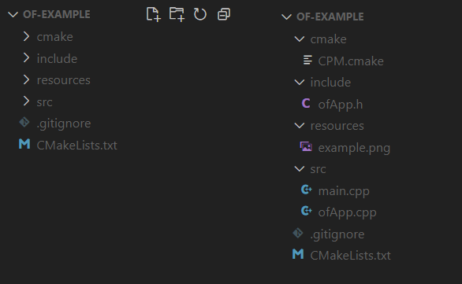
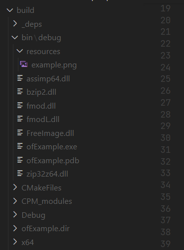

# CMake Support

## Using CMake in your project

Setup steps for a completely new OF project:

 - Create the following file structure:  
     
   As you can see it is very concise.
 - [CPM.cmake](https://github.com/cpm-cmake/CPM.cmake): Just [download the latest release](https://github.com/cpm-cmake/CPM.cmake/releases/latest) and place it in the cmake folder.  
   This is a 100% CMake-based package manager which allows us to easily add dependencies
 - include/ and src/ files are taken from the [emptyExample](examples/templates/emptyExample/README.md)
 - resources are optional
 - .gitignore bare minimum:
   ```gitignore
   [Bb]uild/
   cmake-build-*/
   ```
 - CMakeLists.txt:
   ```cmake
   cmake_minimum_required(VERSION 3.16)
   project(ofExample)
   
   # Include CPM.cmake, a 100% CMake-based dependency manager (https://github.com/cpm-cmake/CPM.cmake)
   include(cmake/CPM.cmake)
   
   # CPMAddPackage("gh:openframeworks/openframeworks#v0.11.2")   # Either the very short version (works for github/gitlab branches, tags and commit hashes)
   CPMAddPackage("gh:HerrNamenlos123/openframeworks#master")   # This line is to be removed from this example once the CMake support is merged into master
   #CPMAddPackage("https://github.com/openframeworks/openFrameworks/archive/refs/tags/nightly.zip")   # Or any URL or archive
   
   # CPM automatically downloads and extract our dependencies, and calls add_subdirectory() for us.
   # This is the fastest and easiest way to pull in modern C++ libraries with good, modern CMake support (especially true for C++17 header-only libraries).
   
   set(SOURCE_FILES
       src/main.cpp                # Here, list all source files
       src/ofApp.cpp
   )
   
   # In Visual Studio we must also add headers and resource files as sources, so they're listed in the IDE
   if (MSVC)
       file(GLOB_RECURSE HEADER_FILES include/**)
       file(GLOB_RECURSE RESOURCE_FILES resources/**)
       list(APPEND SOURCE_FILES ${HEADER_FILES} ${RESOURCE_FILES})
   endif()
   
   # The actual executable to build
   add_executable(ofExample ${SOURCE_FILES})
   source_group(TREE "${CMAKE_CURRENT_LIST_DIR}/" PREFIX "" FILES ${SOURCE_FILES})
   
   # C++ version of the project (independent from the version OF is built with)
   target_compile_features(ofExample PUBLIC cxx_std_17)
   set_target_properties(ofExample PROPERTIES CXX_EXTENSIONS OFF)  # Disable non-standard compiler-specific extensions
   
   # Include directories
   target_include_directories(ofExample PUBLIC include)
   
   # All Targets we depend upon, which pulls in all headers, definitions, libraries, ...
   target_link_libraries(ofExample of::openframeworks of::ofxGui)
   
   # Setting up paths correctly
   set(BIN_DIR "${CMAKE_CURRENT_BINARY_DIR}/bin/$<IF:$<CONFIG:Debug>,debug,release>")
   set_target_properties(ofExample PROPERTIES RUNTIME_OUTPUT_DIRECTORY "${BIN_DIR}")               # Where to place the compiled binary
   set_target_properties(ofExample PROPERTIES VS_DEBUGGER_WORKING_DIRECTORY "${BIN_DIR}")          # Where to run from when debugging with F5 in VS
   of_copy_runtime_to_bin_dir_after_build(ofExample "${BIN_DIR}")                                  # Copy all shared libraries to the target location after building
   set_property(DIRECTORY ${CMAKE_CURRENT_SOURCE_DIR} PROPERTY VS_STARTUP_PROJECT ofExample)       # Set the VS startup project to run when pressing F5
   
   # And potentially also copy any resource files to the target location
   if (EXISTS "${CMAKE_CURRENT_LIST_DIR}/resources")
       add_custom_command(TARGET ofExample POST_BUILD COMMAND ${CMAKE_COMMAND} -E copy_directory "${CMAKE_CURRENT_LIST_DIR}/resources" "${BIN_DIR}/resources")
   endif()
   ```
   
#### Additionally, you can use a precompiled header to speed up the compilation:
```cmake
target_precompile_headers(ofExample PRIVATE "include/pch.hpp")
```
And in `include/pch.hpp`:
```cpp
#ifndef PCH_HPP
#define PCH_HPP

#include "ofMain.h"
// And any other common header files that do not change

#endif //PCH_HPP
```
Here you can add other headers like openFrameworks headers, standard library headers and third-party libraries that do not change frequently.  

This has the effect that these libraries are 'precompiled', which is taking a long time once, but speeding up any subsequent build significantly.


#### And to build it: (Any compiler/toolchain)
```bash
 mkdir build
 cd build
 cmake ..
 cmake --build .
 ```

 - For Visual Studio IDE, skip the last command and open the generated `ofExample.sln`
 - For Visual Studio in the terminal, replace the last command with just `cmake --build .`
 - For CLion and vscode, just open the root `CMakeLists.txt` in CLion or vscode with CMake extension, no terminal commands needed.

#### This results in:

An output directory including all resources and shared libraries it depends on, ready to be released. (see known issues)



## Visual Studio (and multi-config build systems)

The following instructions are for building openFrameworks itself, in the root directory of the repository. Make sure to download a nightly build as soon as CMake support is available, as the main repository takes tremendously longer to download.

Visual Studio automatically uses all available cores.

In the following examples, we always use cmake like `cmake ..` in the build folder. However, you can also use following signature: 
`cmake -S source_dir -B build_dir`. This way the current working directory is irrelevant and the two directories can be anywhere (especially useful for CI toolchains).

### Building in IDE

Open the generated `openFrameworks.sln` in your build folder with Visual Studio. Then, just build it like any other VS project. Right-click a project and click on `Set as Startup Project` to be able to run it with F5.

### Building in the terminal

You can also build Visual Studio projects without actually opening Visual Studio, by the use of MSBuild. CMake does all of that for you. 

Note that configurations in Visual Studio work a bit different compared to makefiles, as VS is a multi-configuration build tool, makefiles are not.

#### Build all examples
```bash
# in root directory of openFrameworks
mkdir build
cd build
cmake ..
cmake --build . --target=build_all_examples --config=Release   # Or 'Debug'
```

#### Build specific example

Replace `ofNodeExample` with the project name of the example.

```bash
# in root directory of openFrameworks
mkdir build
cd build
cmake ..
cmake --build . --target=ofNodeExample --config=Release   # Or 'Debug'
```

#### Run tests

```bash
# in root directory of openFrameworks
mkdir build
cd build
cmake ..
cmake --build . --config=Release   # Or 'Debug'
ctest -C Release                   # Or 'Debug'
```

In the VS IDE, building RUN_TESTS (in CMakePredefinedTargets folder) does the same thing.

## Makefiles (and single-configuration build systems)

#### Building all examples

```bash
# in root directory of openFrameworks
mkdir build
cd build
cmake .. -DCMAKE_BUILD_TYPE=Release             # Or 'Debug'
cmake --build . --target=build_all_examples -j<number-of-cores>
```

#### Building specific example

```bash
# in root directory of openFrameworks
mkdir build
cd build
cmake .. -DCMAKE_BUILD_TYPE=Release             # Or 'Debug'
cmake --build . --target=ofNodeExample -j<number-of-cores>
```

#### Run tests

```bash
# in root directory of openFrameworks
mkdir build
cd build
cmake .. -DCMAKE_BUILD_TYPE=Release            # Or 'Debug'
cmake --build . -j<number-of-cores>
ctest -C Release                               # Or 'Debug'
```

## Jetbrains CLion

When starting with CLion, you do not generate anything with CMake. It's the opposite: You open your root CMakeLists.txt in CLion,
which then calls CMake for you. Time to relax.

CLion is especially useful when it comes to unit tests due to its excellent support for CMake CTest.

### CLion on Windows

Currently, MinGW/MSYS2 is entirely unsupported. If you want to use CLion on Windows, you must use the Microsoft MSVC toolchain 
(Visual Studio), which is also faster and more reliable than MinGW or MSYS as it's native.
If [Visual Studio](https://visualstudio.microsoft.com/de/downloads/) is installed, it is automatically recognized in the CLion toolchain settings.
Thus, you can build using CLion's excellent IDE, while the Visual Studio compiler is used under the hood.
This results in the most robust development experience on Windows.

MinGW support (especially for CI) and more is yet to be finalized by you! :)

## Visual Studio Code

When working with Visual Studio Code, the default C++ extensions are recommended, as well as the CMake extension from Microsoft. 
See the CLion section above, as the same applies to VS Code. The CMake extension simply invokes CMake, which then uses MSVC under the hood.
The CMake extension's panel in the left bar allows you to build and run targets.

This means you can also build and run directly in VS Code, very similar to CLion.

# Known issues

 - Currently, all shared libraries are always copied to the target location, even if they are not linked
 - And only shared libraries of the apothecary are copied, not from system dependencies

# Yet to be done

 - [ ] Test everything on all Apple platforms
 - [ ] Add full support for Android & iOS
 - [ ] Add support for Emscripten
 - [ ] Add support for MinGW/MSYS2
 - [ ] Add CMake install targets, which would allow to:
    - 1: Install the library globally, so that new OF projects can simply link to it instead of building from source.
    - 2: Install projects derived from it into an installation directory, which in turn allows to:
    - 3: Use CMake's CPack to bundle all installed files and create native installers for each platform. (e.g. .exe, .msi, .deb, .rpm, .dmg, etc.)

CMake has excellent support for cross-compilation for all of these platforms, one just needs a working dev environment
to test everything.

Feel free to contribute to make this list shorter, Happy Coding!

### Some hints for a future Android cross-compilation implementer:

> ```bash
>     set(CMAKE_SYSTEM_NAME "Android")
>     set(CMAKE_SYSTEM_VERSION 1)
> 
>     cmake .. -DCMAKE_C_COMPILER=x86_64-linux-android33-clang -DCMAKE_CXX_COMPILER=x86_64-linux-android33-clang++
> 
>     cmake .. \
>         -DCMAKE_C_COMPILER=armv7a-linux-androideabi33-clang \
>         -DCMAKE_CXX_COMPILER=armv7a-linux-androideabi33-clang++ \
>         -DCMAKE_SYSTEM_NAME=Android \
>         -DCMAKE_SYSTEM_VERSION=25
> 
>     cmake .. \
>         -DCMAKE_SYSTEM_NAME=Android \
>         -DCMAKE_SYSTEM_VERSION=25 \
>         -DCMAKE_ANDROID_STANDALONE_TOOLCHAIN=/home/${USER}/android-ndk-r25c/toolchains/llvm/prebuilt/linux-x86_64
> 
> 
> 
>     https://developer.android.com/ndk/guides/cmake#command-line
> 
>     cmake .. -DCMAKE_TOOLCHAIN_FILE=/home/$USER/android-ndk-r25c/build/cmake/android.toolchain.cmake -DANDROID_ABI=x86_64
> 
>     AT LEAST CMake 3.19 !!!
> 
>     To update cmake:
>     deb http://deb.debian.org/debian bullseye-backports main    # put this into /etc/apt/sources.list
>     sudo apt update && sudo apt install cmake -t bullseye-backports
> ```
