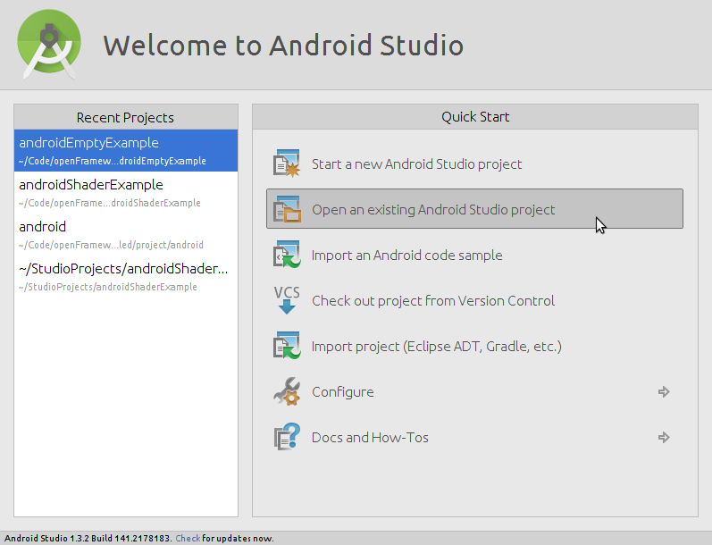
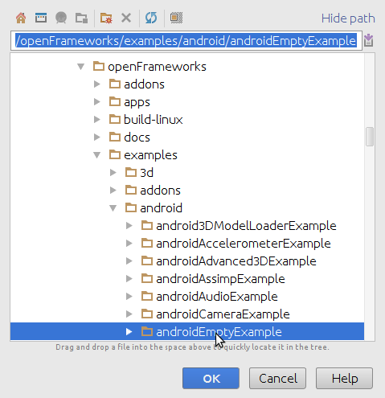
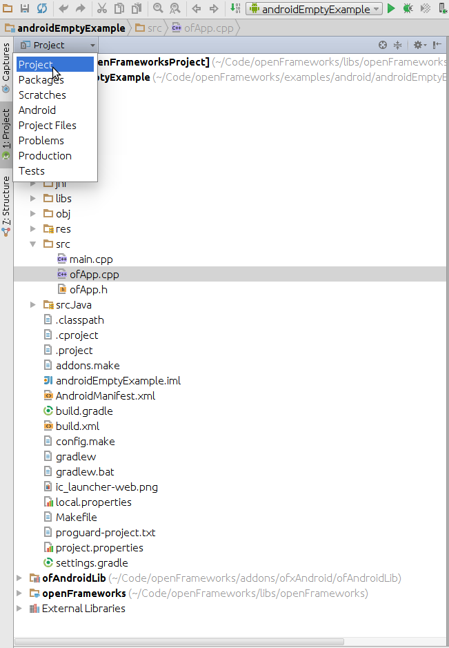
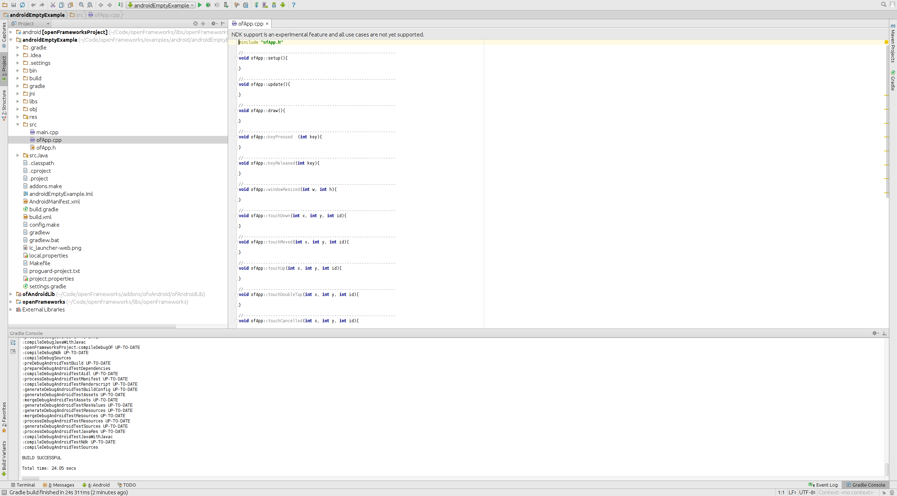

[openFrameworks](http://openframeworks.cc/) | [Documentation table of contents](table_of_contents.md)

Android
=======

The Android distribution of openFrameworks is setup to work with either the Eclipse IDE or experimentally Android Studio IDE. The projects are currently using a custom toolchain based on Makefiles to compile and install applications.

# Android Studio

Android studio support in openFrameworks is still experimental. The latest version of Android Studio still doesn't have full support for C++ development so even if it's deprecated we still recommend to use eclipse and the ADT plugin if you want to have code completion in C++. See `docs/android-eclipse.md` in the distribution or the corresponding [guide](http://openframeworks.cc/setup/android-eclipse/) in the download page.

## Summary

Setting up openFrameworks with Android Studio is fairly straightforward. The basic steps are:

1. Install Android Studio and the Android SDK
3. Download openFrameworks from the download page or from git
2. Install the Android NDK (actually tested version is r10e)
4. Set the path to the NDK in local.properties (`ndk.dir`)
5. In Android Studio, use **File ➞ New ➞ Import Project** and select an openFrameworks example from the examples/android folder
6. Import Project From External Model (Gradel)
6. Build and run

## Installation

### Install Android Studio and the Android SDK

Download and install Android Studio from [https://developer.android.com/studio/index.html](https://developer.android.com/studio/index.html) (you need Android Studio 2.0 or higher). It should come with (or automatically install) a recent SDK, though you can customize the SDK version later from within Android Studio using **Tools ➞ Android ➞ SDK Manager**.

In the event that Android Studio does not come with an SDK, you can install it from [http://developer.android.com/sdk/index.html](http://developer.android.com/sdk/index.html) (under "Get the SDK for an existing IDE").

### Download openFrameworks

Download it from the downloads page:

[http://openframeworks.cc/download](http://openframeworks.cc/download)

Or download the latest nightly build:
[http://openframeworks.cc/download](http://openframeworks.cc/download) (bottom of the page)

You may also check out the openFrameworks source from GitHub (under master branch): [http://github.com/openframeworks/openFrameworks](http://github.com/openframeworks/openFrameworks).

If you clone the openFrameworks repository, please note the additional installation requirements listed in the `INSTALL_FROM_GITHUB.md` file.

### Install the Android NDK

This is the C/C++ compiler, headers and libraries for Android. OF 0.9.0 has been tested with the NDK version r10e, newer versions might work but it's not guaranteed.

[https://developer.android.com/ndk/downloads/index.html](https://developer.android.com/ndk/downloads/index.html)

- macOS: [android-ndk-r10e-darwin-x86_64.bin](http://dl.google.com/android/ndk/android-ndk-r10e-darwin-x86_64.bin)
- Linux 32: [android-ndk-r10e-linux-x86.bin](http://dl.google.com/android/ndk/android-ndk-r10e-linux-x86.bin)
- Linux 64: [android-ndk-r10e-linux-x86_64.bin](http://dl.google.com/android/ndk/android-ndk-r10e-linux-x86_64.bin)
- Windows 32: [android-ndk-r10e-windows-x86.exe](http://dl.google.com/android/ndk/android-ndk-r10e-windows-x86.exe)
- Windows 64: [android-ndk-r10e-windows-x86_64.exe](http://dl.google.com/android/ndk/android-ndk-r10e-windows-x86_64.exe)

On macOS, you may run into extraction errors if you simply double-click on the `*.bin` archive. To ensure that the file unpacks successfully, in the download directory run `chmod u+x android-ndk-r10e-darwin-x86_64.bin` on the command line, then `./android-ndk-r10e-darwin-x86_64.bin` to automatically extract it.

On Windows, you will also need to install MinGW in order to build openFrameworks. MinGW provides some essential build tools which are not included in the NDK. Follow just the "Installing the MinGW and Msys" instructions on [this page](http://www.multigesture.net/articles/how-to-install-mingw-msys-and-eclipse-on-windows/).

Make a note of where you installed the NDK as you will need the path during the next step.

### Configure the NDK

With a text editor, edit the file `libs/openFrameworksCompiled/project/android/paths.make` and set the absolute path to the NDK like this:

    NDK_ROOT=/absolute/path/to/the/ndk

This will tell openFrameworks where to find the android NDK.

The final `libs/openFrameworksCompiled/project/android/paths.make` file should look something like:

    # Default paths.make file.
    # Enter the correct paths for your system and save this file as paths.make

    NDK_ROOT=/Volumes/Android/android-ndk-r10e

### Import the Project

At the Android Studio welcome screen select **Open an Existing Android Studio Project**.

Then browse to any of the android examples in `examples/android`.

Accept all the prompts and wait for Android Studio to set up the project.

You'll have to wait a bit. The first sync will automatically build openFrameworks. If it doesn't work (Gradle sync still fails), try looking at the **Troubleshooting** section below.  In some cases, clicking on the error in the console window will take you to a solution, such as installing various versions of the Android SDK or installing additional versions of Gradle. In some cases, you may have to do this several times to solve several missing dependencies.

### Build and Run

Press the Play button next to the `androidEmptyExample` shown in the toolbar. With any luck, it should build the app and momentarily deploy it to your Android device (or prompt you to deploy it on a suitable emulator). If the app runs, congratulations! You have setup openFrameworks.

### Editing the C++ Source Code

Android Studio before 2.0 had very limited support for C++ source code editing. In any case to work with openFrameworks, you'll want to switch from the Android view to the Project one where you can see all the files in the project including the C++ source code:

## Creating New Projects

1. Copy any of the provided example app (make sure to put it in a subdirectory of `apps/`, at the same level as the sample)
2. Edit the file AndroidManifest.xml and change every appearance to the original name to the new name of you application.
3. In `srcJava/cc/openFrameworks` change the name of the folder to the new name of you application.
4. Edit the file `srcJava/cc/openFrameworks/newApplicationName/OFActivity.java` and change the name of the package to the correct new name.
5. Edit the file `res/values/strings.xml` and change the value of app_name to the new name of the application.
6. Import the new project from Android Studio.

## Troubleshooting

- You may need to close Android Studio and delete your `$HOME/.gradle` directory.

- You may need to adjust the following numbers to match your installed Android Studio and Android SDK. Android Studio should offer to fix these values for you when you open the appropriate build files.
    - The Gradle version specified in `build.gradle`
    - The `compileSdkVersion`, `buildToolsVersion`, `minSdkVersion`, `targetSdkVersion` values in `addons/ofxAndroid/ofAndroidLib/build.gradle` and `apps/myApps/androidEmptyExample/build.gradle`

- If you get strange linker errors, check that you are using the 10e version of the NDK. Newer NDKs might work but usually there are some fixes that need to be done when moving to a new NDK version.

- If your connected device is not recognized by Android Studio, restart `adb` with `adb kill-server && adb start-server`

- If, when synchronizing a project for the first time, clicking on the console messages does not solves the problem regarding a missing dependency of the android API (like for example Android API 22), open the sdk from the console, select the missing API and install it
