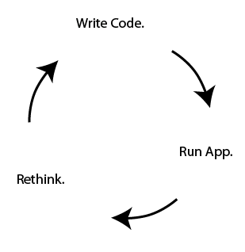
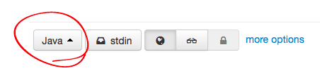
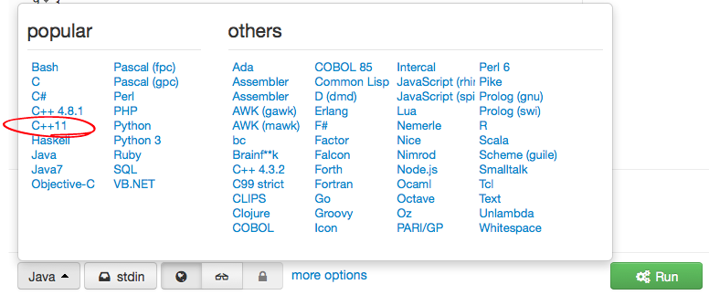
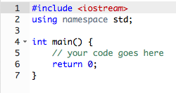
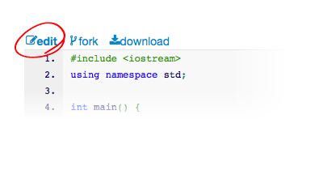
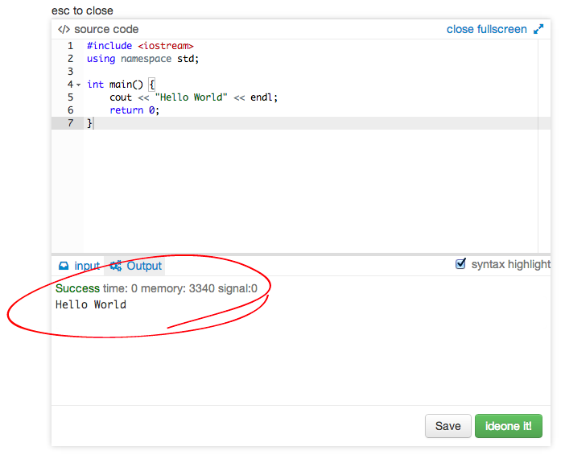

# Chapter 3. C++ Language Essentials

###inspirational quote candidates:

+ A hero is someone who understands the responsibility that comes with his freedom. **--Bob Dylan**

+ Differences of habit and language are nothing at all if our aims are identical and our hearts are open. **--Albus Dumbledore**

+ The magician of the future will use mathematical formulas. **--Aleister Crowley**


##Look Alive!

This chapter introduces you to writing small computer programs using the C++ language. Although I assume very little about your previous knowledge, the literacy you gain from this chapter will directly influence your comprehension in subsequent chapters of the book, as most other topics stand on the shoulders of this one. Furthermore, the lessons herein are cumulative, meaning you can't skip one of the topics or you will get lost. If you get stuck on one of the concepts, please seek help in understanding specifically the part that did not make sense before moving on to the next topic. Following the lessons with this sort of rigor will insure that you will get the most out of OpenFrameworks, but also computers in general.


##Progress Not Perfection


I did most of my drawing and painting in the mid-nineties, a high school AP art student sporting a long black ponytail of hair shaved with a step, round eyeglasses, and never an article of clothing without spill, fling, smattering, or splotch of Liquitex Basics acrylic paint. Bored out of my mind in economics class, playing with my TI-82 graphing calculator, I discovered something that flipped a lightbulb on in my heart. Unlike smaller calculators around my house growing up, the TI-82 had a thick instruction manual. Amidst sections in this manual about trig functions and other dry out-of-reach science, something caught my thirsty, young eye: a sexy black-on-white pyramid with smaller upside-down pyramids infinitely nested inside, shown in Figure 1.


This fractal, the famous *Sierpinski triangle*, accompanied about twenty-five computer instructions making up the full SIERPINS program. I looked closer at the code, seeing a few numeric operations – nothing too advanced, and most of it was commanding words, like "do this", or "if something then do another thing". I was able to key in the code from the book into the graphing calculator and run the program. At first, just a blank LCD panel. Slowly a few random pixels switched to black here and there, not really showing any pattern. After a few more seconds, the scene filled in and I could already see faint outlines of triangles. After a good long time, my calculator finally matched the picture in the book. My mind was officially blown. Certain things did not make sense. What sort of miracle of nature caused such a complex form to come from so little instruction? The screen had over six-thousand pixels in it, so why is it that a mere twenty-five instructions was all it took to create this amazing, organism-like artwork? Whose artwork was it? Might I derive a new work from it? Rarely had I ever seen such a magical reward coming from so little work. I had found my new basics. I felt the need to understand the program because (I decided) it was important. I went back into the code and changed some of the numbers, then ran the program again. The screen went blank, then drew a different picture, only this time, skewed to the left, falling out of the viewport. Feeling more courageous, I attempted to change one of the english instructions, and the machine showed an error, failing to run.



The cycle I just described (write code, run app, re-think program's behavior,  revise code, etc.) as shown in Figure 2, is an infinitely repeating loop that I have had a great pleasure of executing for a couple decades and I still love what I do. Each new cycle never fails to surprise me. As I pursue what it means to create a program, and what it means to create software art, the process of iteratively evolving a list of computer instructions always presents as much logical challenge as it does artistic reward. Very few of those challenges have been impossible to solve, especially with other people available to collaborate and assist, or by splitting my puzzle into smaller puzzles. If you have already written code in another environment like Processing, Javascript, or even HTML with CSS, then this first important lesson might seem too obvious.


For those just now familiarizing themselves with what it means to write small programs, it is important to understand the iterative nature of the code writing process. The anecdote in Figure 3 shows what this process is *not*. Rarely would you ever enter some code into the editor just once, and expect to hit compile and see your finished outcome. It is natural, and commonly accepted for programs to start small, have plenty of mistakes (bugs), and evolve slowly toward a goal of desired outcome or behavior. In fact it is so commonplace that to make the former assumption is a downright programmer's mistake. Even in older days when programs were hand-written on paper, the author still needed to eyeball the code obsessively in order to work out the mistakes, and therefore the process was iterative. In learning the C++ language, I will provide tiny code examples that you will be compiling on your machine. The abnormal part is typing the code from the book into the editor, and (provided your fingers did not slip), the program magically runs. I am deliberately removing the troubleshooting experience in order to isolate out the subject matter of the C++ language itself. Later on, we will tackle the black art of *debugging* as a topic all its own.


##Compiling My First App

Let us start by making the smallest, most immediate C++ program possible, then use the convenient environment to test small snippits of C++ code throughout this chapter. In order to do that, we must have a *compiler*, which is a program that translates some code into an actual runnable app, sometimes referred to as the executable file. C++ compilers are mostly free of charge to download, and in a lot of cases, open source. The apps we generate will not automatically show up in places like Apple's App store, Google Play, Steam, Ubuntu Apps Directory, or Pi Store. Instead, they are your personal, private program files and you will be responsible for manually sharing them later on. In the following chapter *OF Setup and Project Structure*, the compiler will sit on your local computer, able to run offline. For now, we will be impatient and compile some casual C++ on the web using a convenient tool by Sphere Research Labs. Please open your web browser and go to [ideone](http://ideone.com).

You will notice right away that there is an editor already containing some code, but it is set to another language. We will now switch from Java to C++. Down at the bottom left of the editor, press the button that says "Java", as shown in Figure 4.



A menu drops down with a list of programming languages. Please choose C++11, shown in Figure 5.



Notice that the code in the editor changed, and looks something like figure 6.



This is just an empty code template that does nothing, and creates no errors. The numbers in the left hand gutter indicate the line number of the code. Press the green button labelled *Run* and you'll see a copy of the code,  "Success" in the comments, the section labelled *stdin* (standard input) will be empty, and *stdout* (standard output) will also be empty.


###Interlude on Typography

Computer programming code is generally presented in fixed-width typesetting, because it is a form of ascii-art. The indentation, white space characters, and repetitive patterns are all important to preserve and easily eyeball for comparison. Every coder I know except artist Jeremy Rotsztain uses some manner of monospaced font for their code. Some typeface suggestions are Courier, Andale Mono, Monaco, Profont, Monofur, Proggy, Droid Sans Mono, Deja Vu Sans Mono, Consolas, and Inconsolata. From now on, you will see the font style switch to `this style` . . .

```C++
or this style ...
```

. . . and that just means you are looking at some code.


Now please press *Edit* (Figure 7) at the top left of the code editor.



You will see a slightly different editing configuration but the same template code will still be editable at the top. We will now edit the code. Find line 5, where it says:

```C++
// your code goes here .
```

A line beginning with a double forward slash is called a comment. You may type anything you need to in order to annotate your code in a way you understand. Sometimes a it's useful to “comment out code” by placing two forward-slashes before it, because that deactivates the C++ without deleting it. Comments in C++ can also take up multiple lines, or happen inside of some code on 1 line, but the syntax for beginning and ending comment-mode is different. Everything between the /* and the */ becomes a comment:


```C++
/* 
this is a multi-line comment. 
still in comment mode.
*/
```

Please delete the code on line 5 and replace it with the following statement:

```C++
cout << "Hello World" << endl;
```

This line of code tells the computer to say "Hello World" into an implied text-space known as *standard output* (aka. *stdout*). When writing a program, it is safe to expect *stdout* to exist and that the program can say things in it. Other times, it's just a window pane in your coding tool, only used to troubleshoot.

You may put almost anything between those quotes. The quoted phrase is a called a *string* of text. More specifically, it is a *c-string literal*. We will cover more on strings later in this chapter. In the code, the chunk `cout <<` part means "send the following stuff to stdout in a formatted way." The last chunk `<< endl` means "add a carriage return (end-of-line) character to the end of the hello world message." Finally, at the very end of this line of code, you see a semicolon (;). In C++, semicolons are like a full-stop or period at the end of the sentence. We must type a semicolon after each statement, and usually this is at the end of the line of code. If you forget to type that semicolon, the compile fails. Semicolons are useful because they allow multiple statements to share one line, or a single statement to occupy several lines, freeing the programmer to be flexible and expressive with ones whitespace. The compiler does not get confused because you help it out and show it where the statement ends.

While you typed, perhaps you noticed the text became multi-colored all by itself. This convenient feature is called *syntax-coloring* and can subconsciously enhance ones ability to read the code, troubleshoot malformed syntax, and assist in searching. Each tool will have its own syntax coloring system so if you wish to change the colors, please expect that it's not the same thing as a word processor. It will not let me assign the font "TRON.TTF" with a glowing aqua color to *just* to `endl` (which means end-of-line). Instead, I can choose a special style for a whole category of syntax, and see all parts of my code styled that way as long as it's that type of code. In this case, both `cout` and `endl` are considered keywords and so the tool colors them black. If these things show up as different colors elsewhere, please trust that it's the same code as before. The entire code should now look like this:

```C++
include <iostream.h>
using namespace std;

int main(){
	cout << "Hello World" << endl;
	return 0;
}
```

Now press the green "ideone it!" button at the bottom right corner and watch the output console, which is the bottom half of the code editor, just above that green button. You will see orange status messages saying things like “Waiting for compilation”, “Compilation”, and “Running”. Shortly after, the program will itself, execute, its output printed. You should see the new message in Figure 8.



If you made it this far, then give yourself a great big hug. You just wrote your first line of C++ code, you analyzed it, compiled it, ran it, and saw the output. Please send word of your recent success so that we may heed your triumph. Tweet the following: **cout << "Hello World" << endl; #ofBook
**


##Beyond Hello World

Now that we've gotten our feet wet, let's go back and analyze the other parts of the code. The first line is an include statement:

```C++
#include <iostream.h>
```

Similar to *import* in Java and CSS, `#include` is like telling the compiler to cut and paste some other useful code from a file called *iostream.h* at that position in the file, so you can depend on its code in your new code. In this case, iostream.h *provides* `cout` and `endl` as tools I can use in my code, just by typing their names. In C++, a filename ending in **.h** is called a header file, and it contains code you would include in an actual C++ implementation file, whose filename would end in **.cpp**. There are many standard headers built into C++ that provide various basic services – in fact too many to mention here. If that wasn't enough, it's also commonplace to add an external library to your project, including its headers. You may also define your own header files as part of the code you write, but the syntax is slightly different:

```C++
#include "MyCustomInclude.h"
```

In OpenFrameworks, double quotes are used to include header files that are not part of the system installation.

###What's with the # ?

It's a whole story, but worth understanding conceptually. The include statement is not really C++ code, it's part of a completely seperate compiler pass called *preprocessor*. It happens before your actual programmatic instructions are dealt with. They are like instructions for the code compiler, as opposed to instructions for the computer to run after the compile. Using a pound/hash symbol before these *preprocessor directives*, one can clearly spot them in the file, and for good reason too. They should be seen as a different language in which your real C++ code is interleaved. There aren't many C++ preprocessor directives - they are mostly concerned with herding other code. Here are some you might see.


`#define`
`#elif`
`#else`
`#endif`
`#error`
`#if`
`#ifdef`
`#include`
`#line`
`#pragma`
`#undef`

Let's do an experiment. In the code editor, please comment out the include directive on line 1, then run the code. To comment out the line of code, insert two adjacent forward-slashes at the beginning of the line.

```C++
//#include <iostream>
```

The syntax coloring will change to all green, meaning it's now just a comment. Run the code by pressing the big green button at the bottom right, and you'll see something new in the output pane.

```
prog.cpp: In function ‘int main()’:
prog.cpp:5:2: error: ‘cout’ was not declared in this scope
  cout << "Hello World" << endl;
  ^
prog.cpp:5:27: error: ‘endl’ was not declared in this scope
  cout << "Hello World" << endl;
                           ^
```

The compiler found an error and did not run the program. Instead, it's showing you  where it got confused in attempt to help you fix it. The first part, *prog.cpp*: tells you the file that contains the error. In this case, ideone.com saved your code into that default file name. Next, it says `In function ‘int main()’`: file showing you the specific section of the code that contains the error, in this case, between the {curly brackets} of a function called *main*. (We will talk about functions and curly brackets later). On the next line, we see `prog.cpp:5:2:`. The 5 is how many lines from the top of the file, and 2 is how many characters rightward from the beginning of the line. Next, we see `error: ‘cout’ was not declared in this scope`. That is a message describing what it believes it wrong in the code. In this case, it's fairly correct. iostream.h is gone, and therefore no `cout` is provided to us, and so when we try to send "Hello World", the compile fails. On the next couple of lines, you see the line of code containing the fallacious `cout`, plus an extra little up-caret character on the line beneath it, and that is supposed to be an arrow pointing at a character in the code. In this case, the arrow should be sitting beneath the 'c' in `cout`. The system is showing you visually which token is at fault. A second error is shown, and this time, the compiler complains that there is no endl. Of course, we know that in order to fix the error, we need to include <iostream.h> so let us do that now. Please un-comment line 1 and re-run the code.

```C++
#include <iostream>
```

When using OpenFrameworks, you have choice of tools and platforms. Each one shows you an error in a different way. Sometimes the editor will open up and highlight the code for you, placing an error talk bubble for more info. Other times, the editor will show nothing, but the compile output will show a raw error formatted similar to the one above. Whilst sometimes useful that we receive several errors from a compile, it can save a lot of grief if you focus on understanding and fixing the very first error that got reported. After fixing the top error, it is likely that all subsequent errors will elegantly disappear, having all been covered by your first fix.

Moving on to line 2, we see:

```C++
using namespace std;
```

A namespace is


-------------------
#authoring outline & notes

+ origin from Bell Labs, timing, intentions
+ modern role of C++ amongst other languages
+ C versus C++.
+ Why did C become C++?
+ other flavors of C, and why they exist.

+ Variables
+ calling functions
	+ arguments
	+ return
+ defining your own functions
+ conditionals
+ for loop
+ while loop
	+ break
	+ continue
+ arrays
+ header files
+ structs
+ classes
	+ private
	+ public
	+ inheritence

```
@rui where do your OOP and my basic C++ meet?

```

