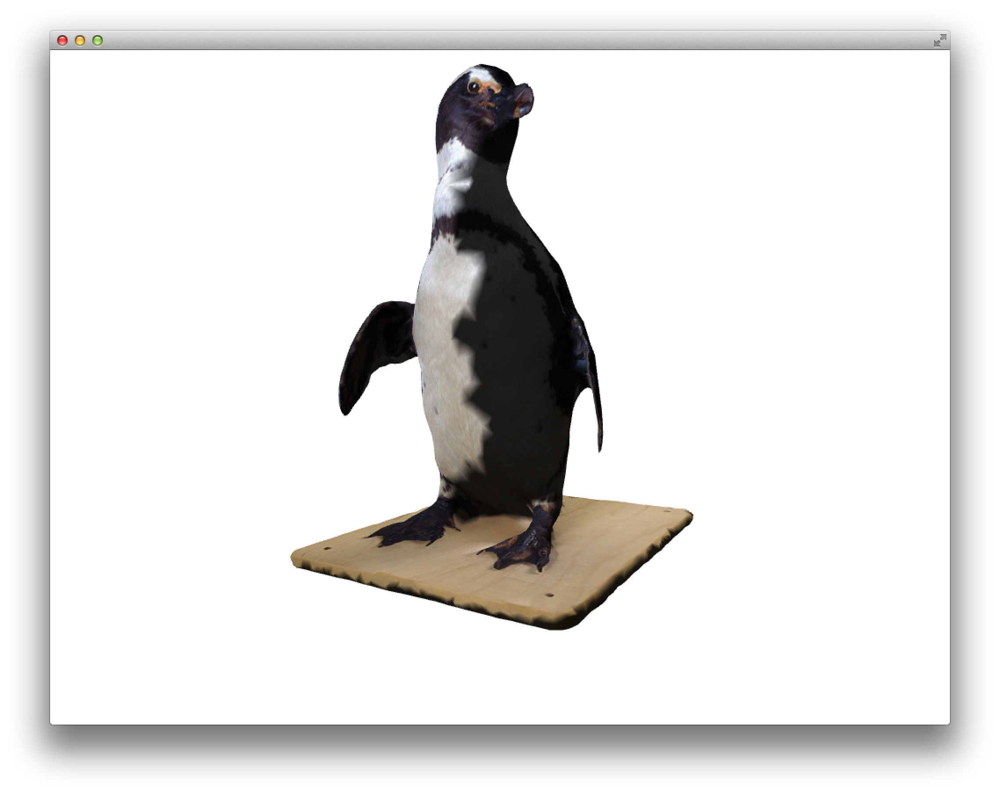

# About 3DModelLoaderExample


### Learning Objectives

Loads in the same 3D penguin model in various file types. Demonstrates how to load in a model using both ofMesh and ofxAssimpModelLoader.

The various models were produced by exporting various formats of the same model from blender.

In the code, pay attention to:

* the usage of the addon ofxAssimpModelLoader, which is used to load in 3D file types including 3ds, .obj, .dae etc. and provide access to their vertices, textures, materials, and animation.
* how the various models render differently and change axis when loaded.
* altering the rotation, position, and scale of the model with  ```model.setRotation()```, ```model.setScale()```, and  ```model.setRotation()```.  
* loading directly into ofMesh, with ```mesh.load(file.ply)``` when key 5 is pressed.


### Expected Behavior

When launching this app, you should see:

* A spinning penguin.
* a text overlay with instructions.

Instructions for use:

* press the number keys to load various models in different formats.
* when in mode 6 use easyCam mouse and keyboard navigation to look around the model.
