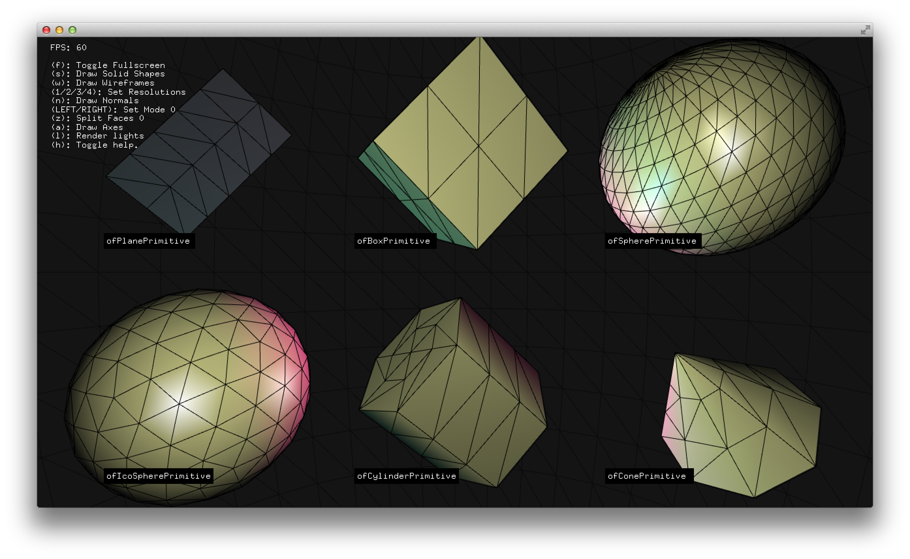

# About 3DPrimitivesExample
--


### Learning Objectives

This openFrameworks Example is designed to demonstrate how to draw basic 3D shapes.

After studying this example, you'll understand how to draw basic 3D form in various states, change the texture, and adjust how the texture is mapped to the geometry.

In the code, pay attention to:

* drawing primitives as wireframes and solids, with ```primitive.drawWireframe();``` and ```primitive.draw();``` .
* drawing them with their normals and axis, with ```primitive.drawNormals();``` and ```primitive.drawAxes();```.
* drawing them at various resolutions, with ```primitive.setResolution();``` . 
* adding a texture to the primitives both from a loaded file and dynamically from a camera, with ```texture.getTexture().bind();``` and ```primitive.mapTexCoordsFromTexture( texture.getTexture() );```.
* altering how the texture is mapped to the geometry, with ``` primitive.mapTexCoords(0, 0, 5, 5);``` .


### Expected Behavior

When launching this app, you should see

* 6 primitive shapes in a grid.
* a text overlay with instructions.

Instructions for use:

* Try pressing the various keys to alter the drawing state. Refer to the overlay on the application to know which keys to press.
