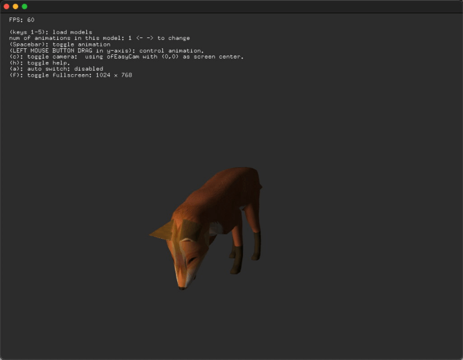

# About assimpExample


### Learning Objectives

This openFrameworks example is designed to demonstrate how to load in 3D animated models and control their animation.


In the code, pay attention to:

* the usage of the addon ofxAssimpModelLoader, which is used to load in 3D file types including 3ds, .obj, .dae etc. and provide access to their vertices, textures, materials, and animation.
* how most of the models being loaded in are collada files (.dae) and directX (.x), which can contain the model and animation.
* the difference in appearence between the .3ds model and the .dae and .X models.
* how to control the animation with ```model.playAllAnimations();```and ```model.setPausedForAllAnimations();``` and ```model.setPositionForAllAnimations();``` and
* setting up the lighting with ```light.enable();``` and ```ofEnableSeparateSpecularLight();```

### Expected Behavior

When launching this app, you should see

* An animated, lit 3D model of a fox.
* A text overlay with instructions.

Instructions for use:

* press the number keys to load various models.
* Click and drag the mouse to control the animation play back.  
