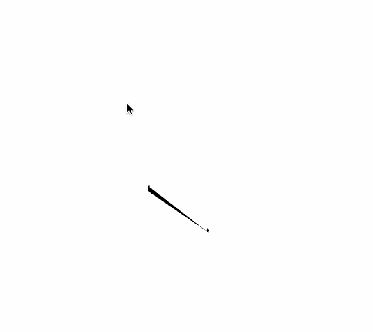

# About cameraRibbonExample
--


### Learning Objectives

This openFrameworks example is designed to demonstrate how to move your camera around and dynamically create a mesh based on mouse input.

In the code, pay attention to:

* adding to a mesh with ```mesh.addVertex()```
* changing the camera position with ```cam.setPosition()```


### Expected Behavior

When launching this app, you should see

* A blank white screen that fills up with a black squiggle when you move your mouse.
* a text overlay with instructions to manipulate the camera.

Instructions for use:

* move your mouse around to make a ribbon.
* press a key to disable the camera.
* click and drag to check out your ribbon
