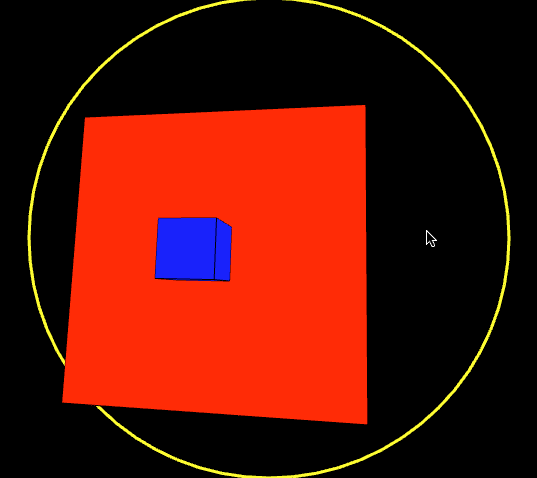

# About EasyCamExample
--


### Learning Objectives

This openFrameworks example is designed to demonstrate how to place an ofEasyCam in your 3D scene and manipulate it with a combination of mouse and keyboard input.

In the code, pay attention to:

* toggling camera input with ```cam.enableMouseInput();``` and ```cam.disableMouseInput();``` .


### Expected Behavior

When launching this app, you should see

* A red cone at the right.
* A white sphere at the left.
* A blue box at the bottom.
* A cyan cylinder at the top.
* A yellow box in the front.
* A magenta box at the back.
* big yellow circle around it.
* a text overlay with instructions to manipulate the camera.

Instructions for use:

* Try manipulating the camera with mouse and key input.
* Notice how mouse interaction is different on ortho and perspective modes.