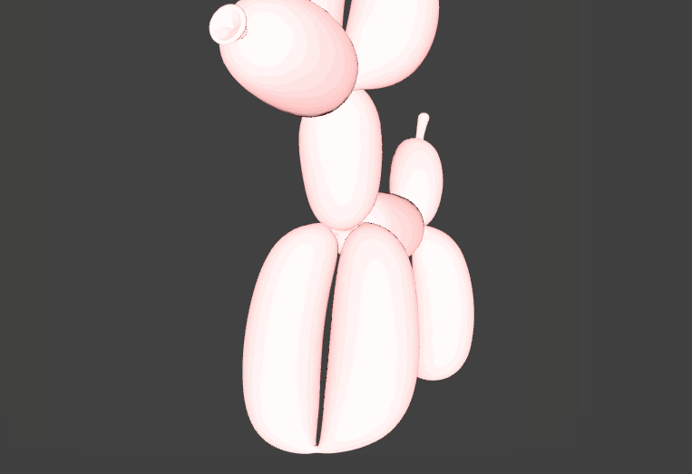

# About modelNoiseExample
--


### Learning Objectives

This openFrameworks example is designed to demonstrate how to load a 3D model and alter its vertices.

After studying this example, you'll understand how to use ofxAssimpModelLoader to load in a 3D model, iterate through its vertices, alter them with perlin noise, and draw them as a mesh.

In the code, pay attention to:

* the usage of the addon ofxAssimpModelLoader, which is used to load in 3D file types including 3ds, .obj, .dae etc. and provide access to their vertices, textures, and materials.
* loading the vertices of the model into a mesh with ```ofVboMesh mesh = model.getMesh(0);```.
* notice how it uses ofVboMesh not ofMesh. A quote from the Advanced Graphics section of ofBook:

	"We can use it [ofVboMesh] exactly the same as an ofMesh, that it 	is actually an ofMesh, but when it's drawn, instead 	of uploading all the vertices to the graphics card 	every time call draw on it, it uploads them once 	when we draw for the first time and only uploads 	them again if they change."

* adding four dimensional perlin noise to each vertice with ```ofSignedNoise();```.


### Expected Behavior

When launching this app, you should see:

* a 3D light pink balloon dog.

Instructions for use:

* move your mouse around to add varrying levels of noise to the model.  
* look in the data folder to see the file being loaded.
* try commenting and uncommenting the lines necessary to draw the original model without noise and the model as a wireframe.
