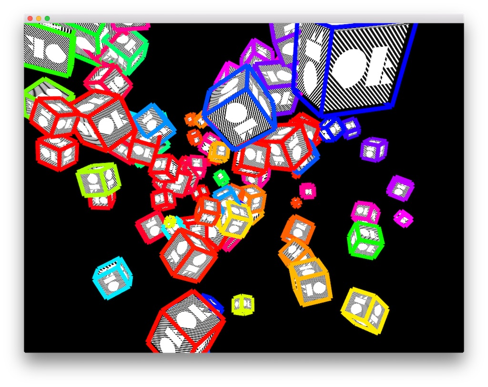

# About ofBoxExample



### Learning Objectives

This example demonstrates the use of the 3D primitive the ofBox. After studying this example, you'll observe some basic information involved in:

* Creating and drawing multiple instances of ofBox
* Using ofEasycam to move around a 3D scene with your mouse
* Creating and binding textures to 3D primitives using ````bind()```` and ````unbind()````

In the example, pay attention to:

* The importance of Depth testing when working with 3D scenes
	* Try commenting out ````ofEnableDepthTest()```` and see what the difference is
* The use of normalized versus arbitrary (Arb) texture coordinates
	* Try commenting out ````ofEnableNormalizedTexCoords()```` and see what the difference is
* The importance of having a light in your 3D scene

### Expected Behavior

When launching this app, you should see a screen with:

* 100 moving 3D boxes textured with a loaded image and outlined with thick colorful lines
* Should be able to rotate the scene with your mouse (click and drag to rotate or pan, or zoom by scrolling)

Instructions for using the app:

* Click and drag (or scroll) in the window to move the 3D Scene. Double click to reset the camera.


### Other classes used in this file

* ofEasycam
* ofLight
