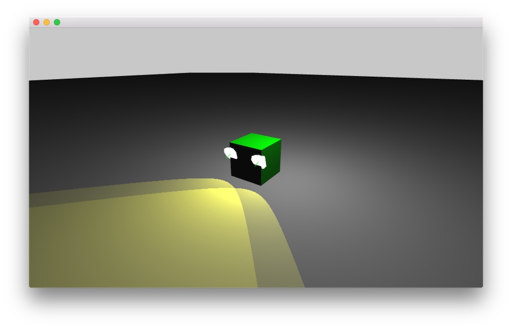

# About ofNodeExample

### Learning Objectives

 This tutorial shows how to use the ofNode to build a hierarchy of objects, it was
 originally developed in a workshop held by Arturo Castro at Lacuna Lab.

 Most 3D classes in OF inherit from ofNode. ofNode is simply a class that defines
 a point in a 3D space and allows it to:
 - Chain a point with another point
 - Apply matrix transformations to it

 We will define an ofNode directly in this example and use its powerful methods to move around the truck. The children will move along with it.

In this example we want to create a truck with a body, 2 headlamps, 4 wheels and an OF logo in the truck bed. We want to move the lights, wheels and OF logo together with the truck, without re-calculating the position child objects.

We define only how the truck should move into the space, the lights just need to stay on the front of the truck, and their movement is just a consequence of the movement of the truck.

Have a look at the Truck.cpp file to see how we attach the lights on the front of the truck and how to move the object using the handy rotate, move and tilt methods - without needing to use ofPushMatrix and ofPopMatrix. The wheels rotate and the truck body responds to the steering and forward/backwards movement.

Also take note of the sounds and when they are triggered in the Truck.cpp update function.

In the example, pay attention to:

* The 3D movement methods in Truck.cpp that make use of ofNode parent/child relationships
* The application and use of 3D materials like `roadMaterial`

### Expected Behavior

When launching this app, you should see a screen with:

* A 3D scene with a grey plane/floor
* A teal truck with 2 "headlights" attached to the front of it composed of several meshes loaded from file.
* Should be able to rotate the scene with your mouse (click and drag to rotate or pan, or zoom by scrolling)

Instructions for using the app:

* Click and drag (or scroll) in the window to move the 3D Scene. Double click to reset the camera.
* Use your keyboard arrow keys to move your "truck" around the scene
* press the `r` key to reset the location of the truck.

### Other classes used in this file

* ofEasycam
* ofLight
* Truck.h (custom class for the example)
* ofMesh
