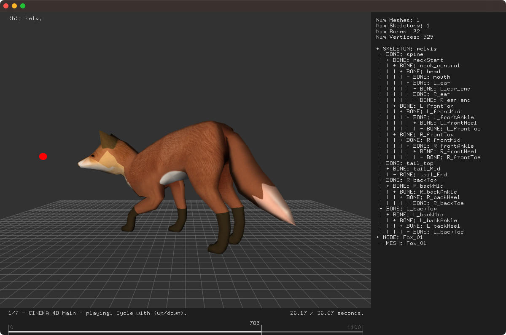

# About ofxAssimpBoneControlExample


### Learning Objectives

This openFrameworks example is designed to demonstrate how to load a 3D animated model and control their animation as well as their bones programmatically.


In the code, pay attention to:

* the usage of the addon ofxAssimp, which is used to load in 3D file types including 3ds, .obj, .dae etc. and provide access to their vertices, textures, materials, and animation.
* the model being loaded is (.fbx), which contains the model, materials and animations.
* adding animations based on keyframes ```addAnimation()```.
* how to control the animation with ```model.transitionCurrentAnimation();```and ```model.play();```
* getting bones, nodes or meshes ```model.getNodeAsType<ofx::assimp::Bone>("*:neck_control");``` 

### Expected Behavior

When launching this app, you should see

* An animated, lit 3D model of a fox.
* A scene hierarchy text.
* A timeline showing animation information.
* The fox should look at the red sphere.

Instructions for use:

* Press the 'h' key to view the help text.
* Move the mouse up and down to change the look at position.  
