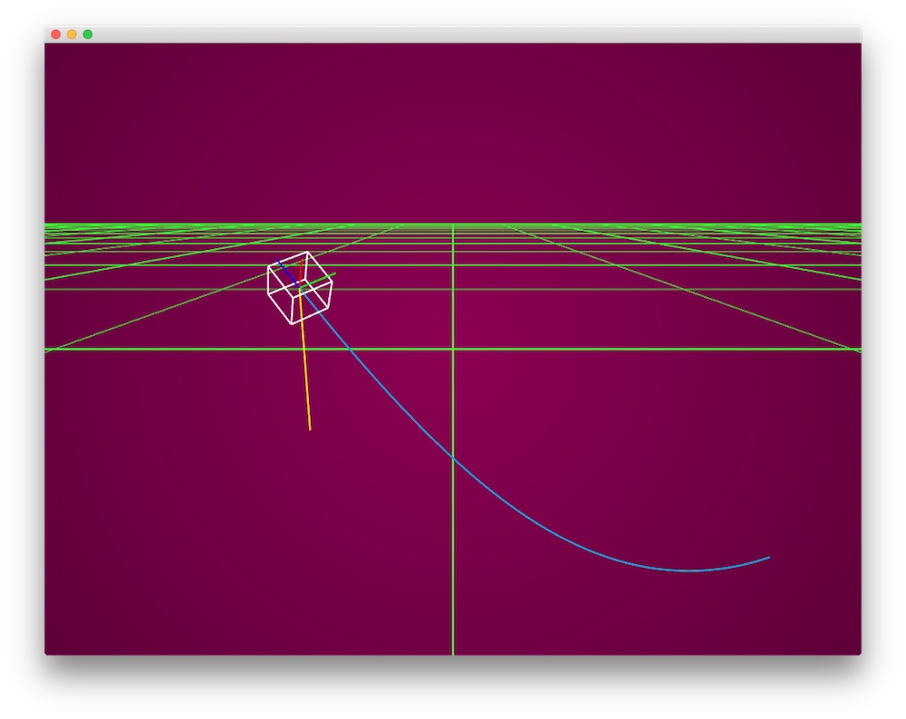

# About orientationExample

### Learning Objectives

This example demonstrates the concept of using the normal of a line to orient a box in 3D space.

This is helpful if you want to have a shape follow the correct direction of a line (have an arrow always point correctly forward when a user draws a line, for example)

The example creates a blue line using a mesh created from a deque of stored points. Those stored points are created using a noise function in `update()`

The points are then passed to the `rotateToNormal(glm::vec3 normal)` function that effects the rotation of the white ofDrawBox and ensures that it stays aligned to the front of the path of the blue line. There are multiple ways to do this, and this is just one example of working with normals in 3D space.

[Wikipedia on normals](https://en.wikipedia.org/wiki/Normal_(geometry)

Pay close attention to how rotateToNormal takes in the difference between the current and previous point on the line - this creates our normal vector. The function then calculates the rotation that would correctly rotate the white cube to the normal of the blue line. Normals are a very deep concept that are used in everything from orientation to calculating lighting.

### Expected Behavior

When launching this app, you should see a screen with:

* A 3D scene with a magenta background, green grid, blue line, and a white cube
* The white cube should follow the orientation of the blue line and keep its rotation aligned with the cube

Instructions for using the app:

* Click and drag (or scroll) in the window to move the 3D Scene. Double click to reset the camera.

### Other classes used in this file

* ofEasyCam
* ofMesh
