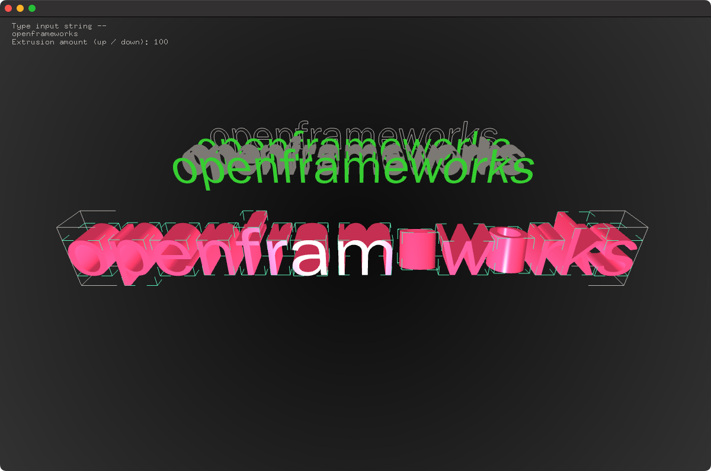

# About Paths to Meshes Example
--


### Learning Objectives

This openFrameworks example demonstrates how to create meshes from paths that were generated by a font.

You will learn how to..
* load a font
* get paths, polylines and meshes from a string passed to the font
* use the polylines to create an extruded mesh
* calculate bounds and centroids on meshes
* make mesh vertices relative to its centroid

Pay attention to..
* ```font.getStringAsPoints``` to get a vector of ofPaths from the font based on a string
* getting a vector of ofPolyline using ```path.getOutline();```
* Building triangles using ```pmesh.addIndex``` 
* Constructing a single mesh from multiple meshes using ```compedMesh.append(pmesh);```
* ```ofEnableDepthTest``` to ensure rendering happens according to z-depth rather than draw order.
* ```node.setOrientation( glm::angleAxis(ofDegToRad(spin), axis ));``` to rotate the nodes
* ```cam.begin``` use of an ```ofEasyCam``` to render the scene 


### Expected Behavior

When launching this app, you should see
* An mesh created from extruded text reading `openframeworks`

Instructions for use:
* Try typing to alter the text.
* Press `up` and `down` to change the extrude amount.

This Example uses the following classes:
* [ofLight](https://openframeworks.cc///documentation/gl/ofLight/)
* [ofMesh](https://openframeworks.cc/documentation/3d/ofMesh/)
* [ofMaterial](https://openframeworks.cc///documentation/gl/ofMaterial/)
