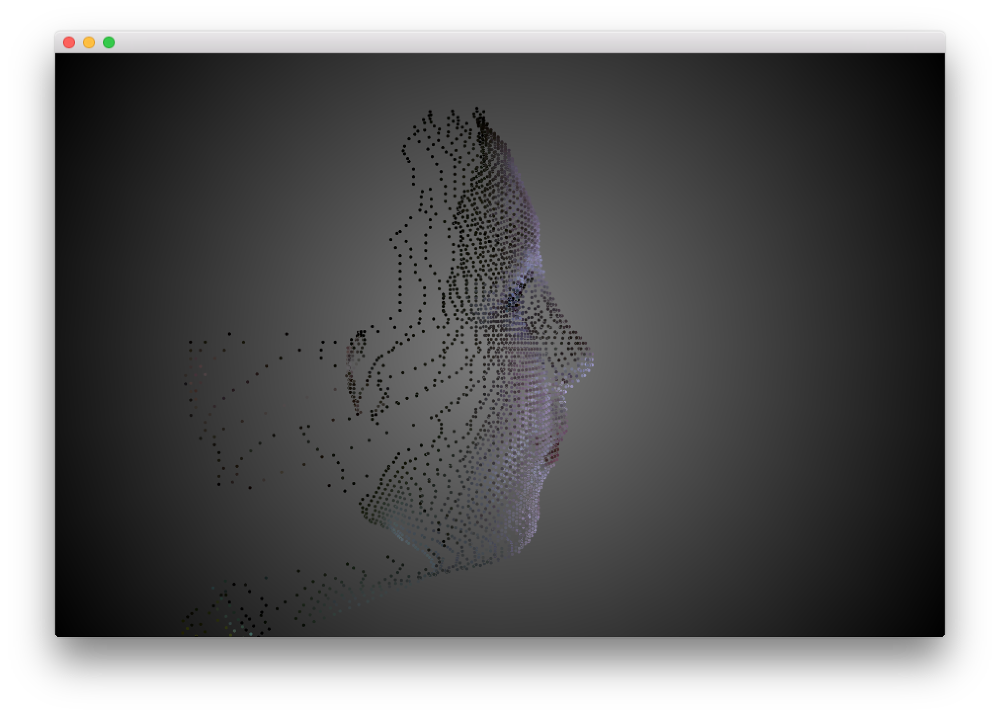

#About Point Cloud Example
--


###Learning Objectives

This openFrameworks Example is demonstrates how to create a [point cloud] (https://en.wikipedia.org/wiki/Point_cloud) of data points in 3d space from an image, and represented by a mesh to represent the exterior surface.

After studying this example, you will understand how to 

In the code, pay attention to:

* ```ofSetVerticalSync``` to synchronize the redraw of the screen to the vertical refresh of your screen
* setting the mode of the [mesh](http://openframeworks.cc/documentation/3d/ofMesh/) to use points with ```mesh.setMode(OF_PRIMITIVE_POINTS);``` 
* Loading the image using ```img.load``` and then examining the pixels in the image by looping through the grid of pixels and getting color with ```img.getColor(x,y)```
* Utilizing the alpha value of the current pixel from the image to determine the z space coordinate and mapping it to a good depth range```float z = ofMap(cur.a, 0, 255, -300, 300);```
* ```ofEnableDepthTest``` to ensure rendering happens according to z-depth rather than draw order.
* ```glEnable(GL_POINT_SMOOTH)``` to make the points round
* ```glPointSize(3)``` to the points bigger
* ```ofScale(2,-2,2)``` to flip the y axis and zoom the item in 
* ```ofRotateY(90)``` to rotate on the y axis so we are looking at the face from the side. 
* ```cam.begin``` use of an ```ofEasyCam``` to render the scene 


### Expected Behavior

When launching this app, you should see 

* A mesh that uses points to draw the exterior surface of the side of a face

Instructions for use:

* Try pressing the various keys to alter the drawing state. Refer to the overlay on the application to know which keys to press. 


