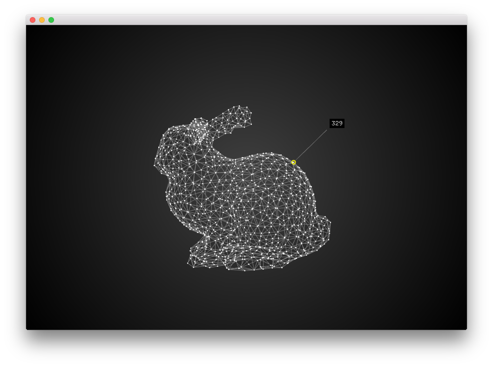

#About Point Picker Example
--


###Learning Objectives

This openFrameworks example demonstrates how to load a .ply file ( [Polygon File Format](https://en.wikipedia.org/wiki/PLY_(file_format)) ) into a mesh. Each of the points are identifible with their index exposed by mousing near it. 


In the code, pay attention to:

* ```ofSetVerticalSync``` to synchronize the redraw of the screen to the vertical refresh of your screen
* ```mesh.load("lofi-bunny.ply")``` to load a .ply file into the mesh
* Creation of the wireframe in the mesh using ```mesh.drawWireFrame()````
* Setting of the point size with ```glPointSize(2)```
* Drawing of the vertices by the mesh using ```mesh.drawVertices```
* Use of a camera to render the scene with ```cam.begin()``` and ```cam.end()```
* Conversion of the vertex from the mesh to screen coordinates to evaluate distance from the mouse with ```cam.worldToScreen(mesh.getVertex(i))```
* Using ```cur.distance(mouse)``` to determine distance between the mouse coordinates and that of the vertex. Lowest distance is identified as the nearest vertex to the mouse.
* Drawing of line from the nearest vertex to the mouse using ```ofDrawLine(nearestVertex,mouse)``` 

### Expected Behavior

When launching this app, you should see 

* A mesh that reflects a low polygon bunny model with points and flat polygons drawn. 

Instructions for use:

* Move the mouse near the points in the mesh to see their index number


