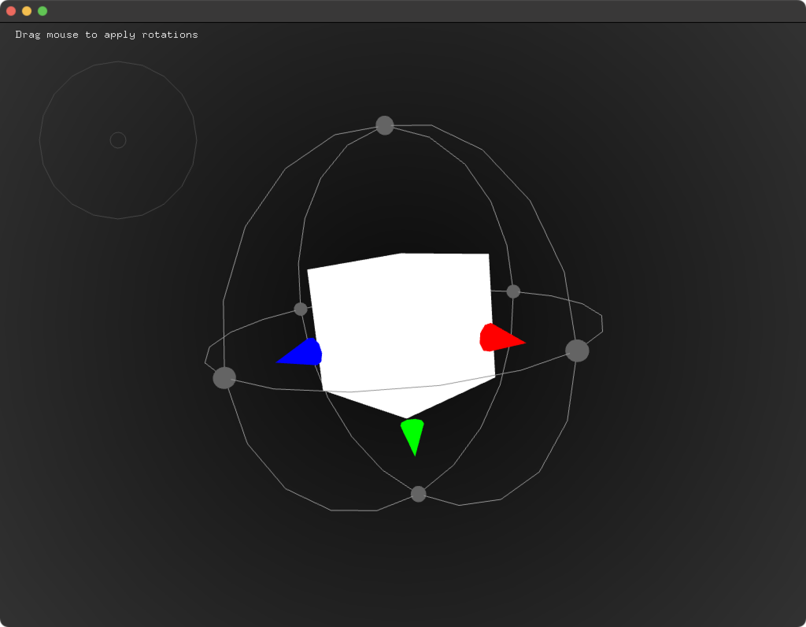

# About Quaternion Arc Ball Example
--


### Learning Objectives

This openFrameworks example illustrates how to rotate a cube as an arcball by dragging it, utilizing quaternions.


In the code, pay attention to:

* ```  ofTranslate(ofGetWidth()/2, ofGetHeight()/2, 40); ``` to make 0,0 the center of the screen
* ```curRot = xRot * yRot * curRot;``` which calculates the current rotation
* ```ofDrawBox``` to draw the cube
* ```ofMultMatrix( glm::mat4(curRot) )``` which applies the rotation from the quaternion to the viewport
* ```ofApp::mousePressed```to capture the last position of the mouse when pressed
* ```void ofApp::mouseDragged``` to capture the mouse drag movement change and apply those changes in terms of rotation to be applied in the ```draw``` function


### Expected Behavior

When launching this app, you should see

* A white cube centered in the middle of the screen with a black background

Instructions for use:

* Drag the mouse across the cube to rotate it.
