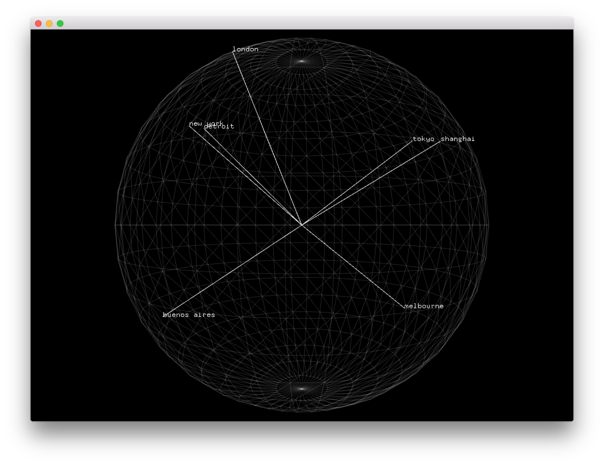

# About QuaternionLatLong Example
--


### Learning Objectives

This openFrameworks example utilizes quaternions to plot latitude and longitude onto a sphere.


In the code, pay attention to:

*  ```cities``` which is a Vector to hold ```City``` objects for the data to plot onto the sphere
* ```  camera.begin() ``` to enable the camera and allowing drawing in the center of the screen
* ```ofRotateDeg(earthSpin, 0, 1, 0);``` to spin the earth
* ```earthMesh.draw()``` to draw the sphere
* ```glm::angleAxis(ofDegToRad(-alatitude), glm::vec3(1, 0, 0));``` to create a quaternion which will perform a rotation of an angle
* ```glm::angleAxis(ofDegToRad(alongitude), glm::vec3(0, 1, 0));``` to create a quaternion which will perform a rotation of an angle
* ```glm::angleAxis(ofDegToRad(90+earthSpin), glm::vec3(0, 1, 0));``` to create another quaternion to ensure it spins on the y axis
* ```glm::vec3 worldPoint = spinQuat * longRot * latRot * center;``` to generate the point to map the city by multiplying all of the quaternions and then multipying the center vector to apply the rotation to the center vector


### Expected Behavior

When launching this app, you should see

* A grey textures mesh sphere centered in the middle of the screen with a black background
* The sphere will have the cities latitude and longitude mapped and labeled on the sphere
* The sphere will be constantly rotating
* A small flying object will travel between cities
