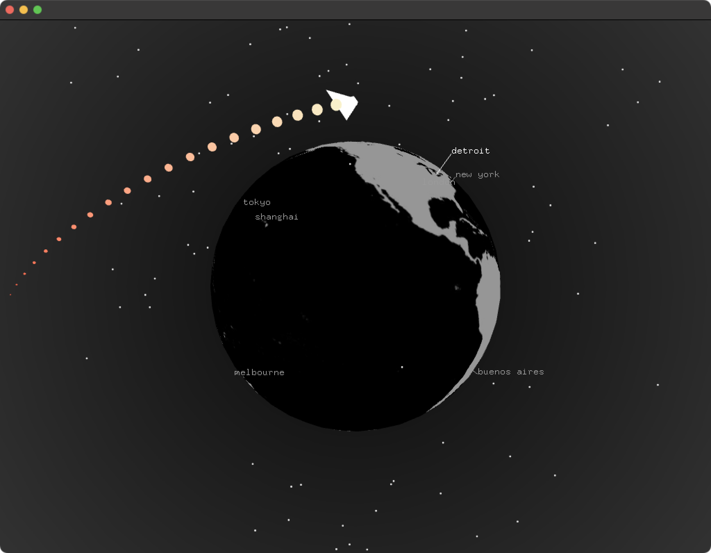

# About QuaternionLatLong Example
--


### Learning Objectives

This openFrameworks example utilizes quaternions to  plot latitude and longitude onto a sphere.


In the code, pay attention to:

*  ```cities``` which is a Vector to hold ```City``` objects for the data to plot onto the sphere
* ```  ofTranslate(ofGetWidth()/2, ofGetHeight()/2, 40); ``` to make 0,0 the center of the screen
* ```ofRotate(ofGetFrameNum(), 0, 1, 0);``` to spin at the rate of 1 degree per frame
* ```ofDrawSphere``` to draw the sphere
* ```latRot.makeRotate(cities[i].latitude, 1, 0, 0);``` to create a quaternion which will perform a rotation of an angle
* ```longRot.makeRotate(cities[i].longitude, 0, 1, 0);``` to create a quaternion which will perform a rotation of an angle
* ```	spinQuat.makeRotate(ofGetFrameNum(), 0, 1, 0);``` to create another quaternion to ensure it spins on the y axis
* ```ofVec3f worldPoint = latRot * longRot * spinQuat * center;``` to generate the point to map the city by multiplying all of the quaternions and then multipying the center vector to apply the rotation to the center vector


### Expected Behavior

When launching this app, you should see

* A white mesh sphere centered in the middle of the screen with a black background
* The sphere will have the cities latitude and longitude mapped and labeled on the sphere
* The sphere will be constantly rotating
