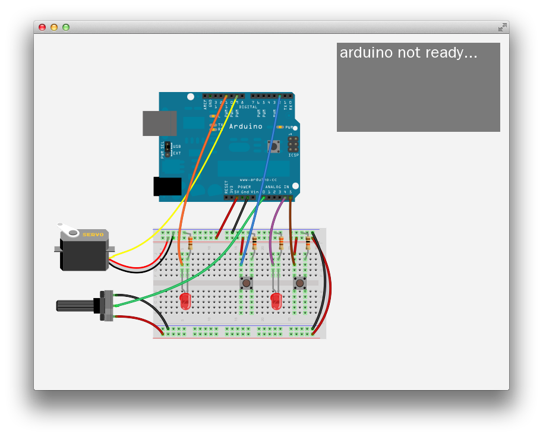

# About firmataExample




### Learning Objectives

This Example demonstrates communication with Arduino using the Firmata protocol.

Running this example requires uploading Firmata to your Arduino. With your Arduino connected, open Arduino and navigate to File -> Examples -> Firmata and open StandardFirmata. Compile and upload StandardFirmata for your board before running this application.

This example covers the following functions:

* Connecting to an Arduino and setting port and baud rate
* Sending and receiving digital and analog signals
* Adding and removing event listeners on the Arduino port

In the code, pay attention to:

* Arguments for connecting to a board, specifying serial port and baud rate: ```ard.connect("/dev/tty.usbmodemfd121", 57600)```
* ```ofAddListener()``` and ```ofRemoveListener()``` on the setupArduino() function to listen for connection
* Console logs indicating connection status
* Functions for addressing different Arduino elements, such as:
* ```sendPwm()``` for pulse width modulation and fading
* ```sendServo()``` for controlling servo motors
* ```sendDigital()``` for sending digital pulses (HIGH / LOW)
* ```sendAnalog()``` for sending analog data (in a 0-255 range)


### Expected Behavior

When launching this app, you should see a screen with an image of an Arduino and a breadboard.

While the Arduino is not connected,

### Instructions for use:

* Click the mouse to turn an LED on and off
* Left and right keys control rotation of a servo motor

### Other classes used in this file

This Example uses no other classes.
