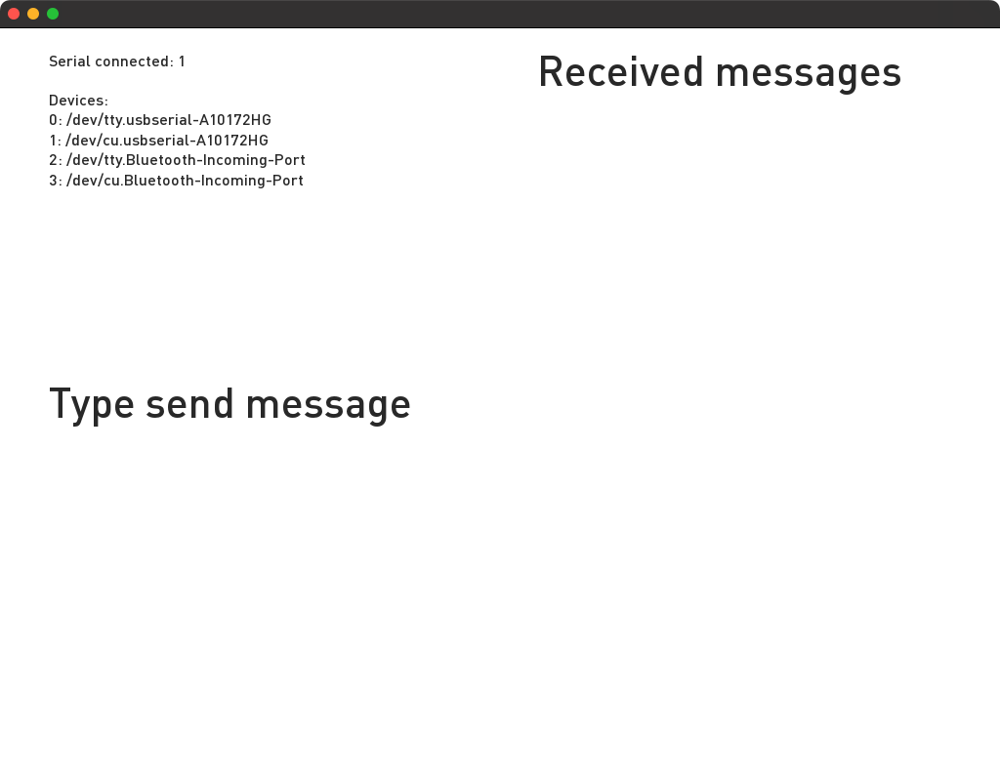

# About serialExample




### Learning Objectives

This example demonstrates communication with external devices over the serial port. In this example, you will connect to a serial device, read incoming byte packets from the connected device, and send response messages over serial.

This example covers the following functions:

* Connecting to a serial device
* Reading incoming byte packets from the connected device
* Sending response messages over serial
* Updating graphics based on the incoming byte information

In the code, pay attention to:

* Listing all serial devices with ```serial.listDevices()```, which logs a list to the console. Make sure the port ID you specify is the same that your Arduino or other device is connected on.
* When a device is connected, check the console logs to ensure that you're not getting any Serial connection errors and have successfully connected to the specified port
* To signal successful communication back to the Arduino, send a trigger message: ```serial.writeByte('a')```
* Read incoming messages with ```serial.readBytes()```
* Store incoming messages in an array ```bytesReturned[3]``` to match the set of data being sent from the Arduino sketch. This can be changed to match the size of discrete data packets being sent from Arduino.


### Expected Behavior

When launching this app, you should see a white screen with gray text showing the following information:

* nBytes read
* nTimes read
* read byte
* time of reading

### Instructions for use:

* Click the mouse to send a communication trigger to Arduino and receive a serial packet in return. The displayed values onscreen should change to reflect sent and received data.

### Other classes used in this file

This example uses no other classes.
