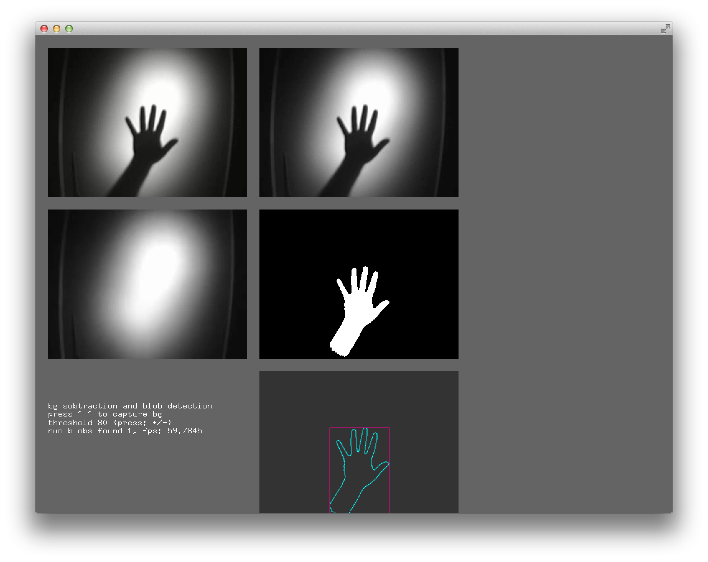

# About opencvExample



### Learning Objectives

OpenCV is a powerful open-source library for image processing and computer vision. This example demonstrates one particularly common workflow in new-media art: performing *background subtraction*, *blob detection* and *contour tracing*. This is immensely useful for locating objects or people that have entered a scene!

After studying this example, you'll understand how to:

* Obtain video from a camera or stored file
* Use that video as the basis for image processing operations with OpenCV, including image arithmetic
* Extract blobs and their contours from background subtraction, a common workflow in computer vision applications.


### Expected Behavior

When launching this app, you'll see a window that displays five different stages in processing a video.

1. In the upper-left is the raw, unmodified video of a hand creating a shadow. Although it's not obvious, this is a color video (that happens to be showing a mostly black-and-white scene). After reading the hand video from its source file (using an `ofVideoPlayer`), this video is stored in `colorImg`, an `ofxCvColorImage`.
2. In the upper-right of the display is the same video, converted to grayscale. Here it is stored in the `grayImage` object, which is an instance of an `ofxCvGrayscaleImage`. It's easy to miss the grayscale conversion; it's done implicitly in the assignment `grayImage = colorImg;` (line 48 in the ofApp.cpp file) using operator overloading of the `=` sign. In this example, all of the subsequent image processing is done with grayscale (rather than color) images.
3. In the middle-left is a view of the *background image*. This is a grayscale image of the scene captured when the video first started playing, before the hand entered the frame. (See line 48 of the ofApp.cpp file.)
4. In the middle-right is an image that shows the *thresholded absolute difference* between the current frame and the background frame. This image has been *binarized*, meaning that pixel values are either black (0) or white (255). The white pixels represent regions that are significantly different from the background: the hand!
5. In the bottom right, an `ofxCvContourFinder` has been tasked to `findContours()` in the binarized image. It does this by identifying blobs of white pixels that meet certain area requirements -- and then tracing the contours of those blobs into an `ofxCvBlob` outline of (x,y) points. The app shows the contour of each blob in cyan, and also shows the bounding rectangle of those points in magenta. *Note:* The contour is a vector-based representation, and can be used for all sorts of further geometric play....

There are a few user-modifiable settings in this app:

* Pressing the `space` bar will capture a fresh image of the background.
* Pressing the `+` and `-` keys will adjust the threshold used in the absolute differencing operation. The greater the threshold value, the more different a pixel needs to be from the background in order to be considered part of the "foreground".

**One more thing.** In line 7 of the `ofApp.h` file, you'll see the following line commented out:

```cpp
//#define _USE_LIVE_VIDEO
```
 If you uncomment this line, the app will use your computer's built-in webcam instead of a stored video file! It accomplishes this by swapping out the `ofVideoPlayer` with an `ofVideoGrabber`.


### Other classes used in this file

This example links against the `ofxOpenCv` core addon. It uses the following classes from that addon:

* [ofxCvColorImage](http://openframeworks.cc/documentation/ofxOpenCv/ofxCvColorImage/)
* [ofxCvGrayscaleImage](http://openframeworks.cc/documentation/ofxOpenCv/ofxCvGrayscaleImage/)
* [ofxCvContourFinder](http://openframeworks.cc/documentation/ofxOpenCv/ofxCvContourFinder/)
* [ofxCvBlob](http://openframeworks.cc/documentation/ofxOpenCv/ofxCvBlob/) *(used implicitly)*

In addition, this example uses the following classes to access  video from a live camera and/or a pre-stored file:

* [ofVideoPlayer](http://openframeworks.cc/documentation/video/ofVideoPlayer/)
* [ofVideoGrabber](http://openframeworks.cc/documentation/video/ofVideoGrabber/)
