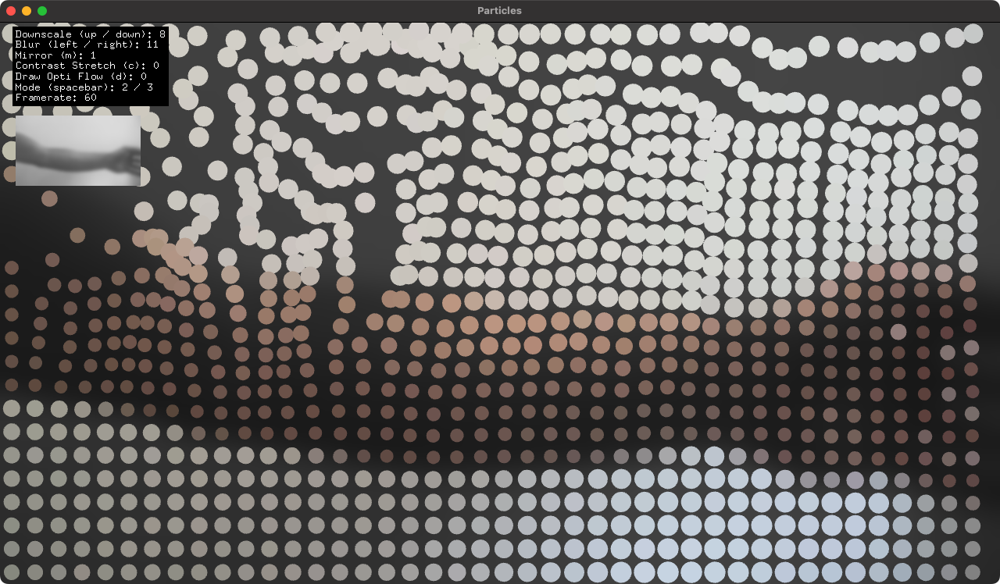

# About opencv Optical Flow Example



### Learning Objectives

OpenCV is a powerful open-source library for image processing and computer vision. This example demonstrates one particularly common workflow in new-media art: performing *optical flow*. This is immensely useful for determining movement within the scene!

After studying this example, you'll understand how to:

* Obtain video from a camera or stored file
* Use that video as the basis for image processing operations with OpenCV, including image arithmetic
* Extract optical flow data using cv::Mat and apply that information to move objects around in the scene.


### Expected Behavior

When launching this app, you'll see a low resolution, colorized representation of the video. Movement in the video will cause elements in the app to change color, spin or move about the screen.

There are a few user-modifiable settings in this app:

* Pressing the `space` bar will change between the 3 modes.
* Pressing the `up` and `down` keys will adjust the size of the opencv image that is used for calculating optical flow. The smaller the image, the faster the operation.
* Press the `left` and `right` arrow keys to change the blur amount.
* Mirror the image by pressing the `m` key.
* View the optical flow by pressing the `d` key.

**One more thing.** In line 7 of the `ofApp.h` file, you'll see the following line commented out:
```cpp
//#define _USE_LIVE_VIDEO
```
 If you uncomment this line, the app will use your computer's built-in webcam instead of a stored video file! It accomplishes this by swapping out the `ofVideoPlayer` with an `ofVideoGrabber`.


### Other classes used in this file

This example links against the `ofxOpenCv` core addon. It uses the following classes from that addon:

* [ofxCvColorImage](http://openframeworks.cc/documentation/ofxOpenCv/ofxCvColorImage/)
* [ofxCvGrayscaleImage](http://openframeworks.cc/documentation/ofxOpenCv/ofxCvGrayscaleImage/)
* [opencv Optical Flow](https://docs.opencv.org/4.x/d4/dee/tutorial_optical_flow.html)

In addition, this example uses the following classes to access  video from a live camera and/or a pre-stored file:

* [ofVideoPlayer](http://openframeworks.cc/documentation/video/ofVideoPlayer/)
* [ofVideoGrabber](http://openframeworks.cc/documentation/video/ofVideoGrabber/)
