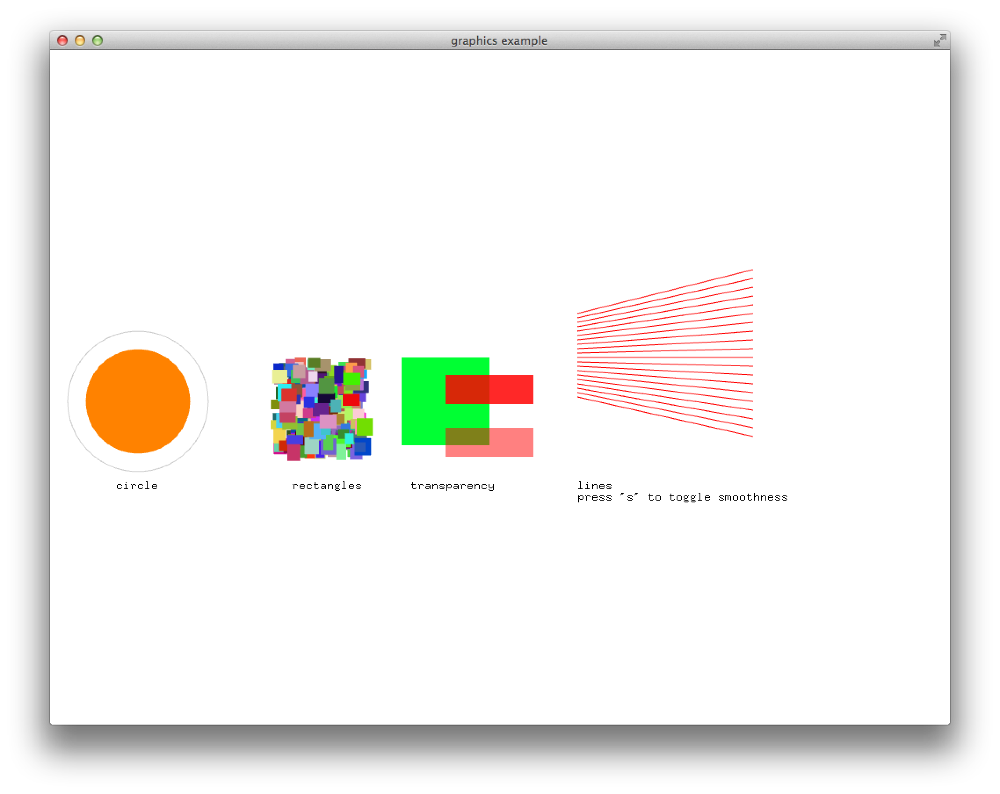

#About graphicsExample


###Learning Objectives

This Example demonstrates a few of the most basic graphics capabilities of openFrameworks. 

After studying this example, you'll understand how to render some simple colored lines and elementary shapes, such as ellipses and rectangles.

In the code, pay attention to: 

* Different commands for setting the active color, such as ```ofSetColor()``` and ```ofSetHexColor()```.
* Toggling transparency, with ```ofEnableAlphaBlending()``` and ```ofDisableAlphaBlending()```.
* Toggling of shape fills, with ```ofFill()``` and ```ofNoFill();```.
* Toggling the anti-aliasing of lines, with ```ofEnableAntiAliasing()``` and ```ofDisableAntiAliasing()```.
* Rendering bitmap text to the screen, with ```ofDrawBitmapString()```.

### Expected Behavior



When launching this app, you should see a screen with

* A filled and unfilled (outline) circle
* A group of 200 randomly colored rectangles
* Some transparent and opaque rectangles
* Some diagonal red lines
* Some bitmap text. 

Instructions for use:

* Press ```s``` to toggle whether or not the red lines are anti-aliased ("smooth"). 

###Other classes used in this file

This Example uses no other classes.