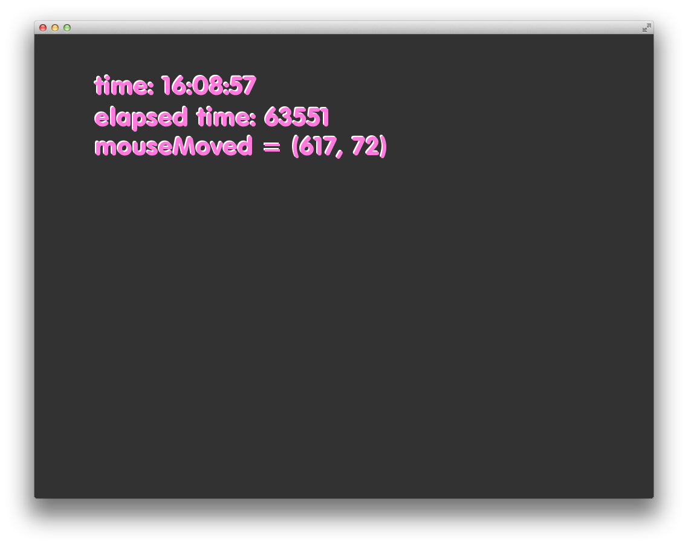
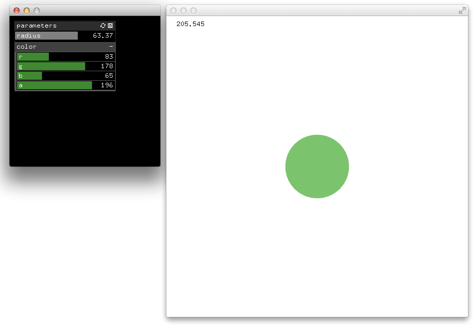
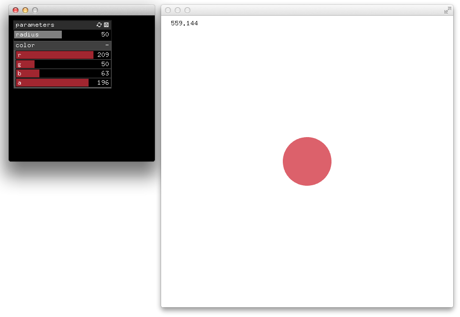
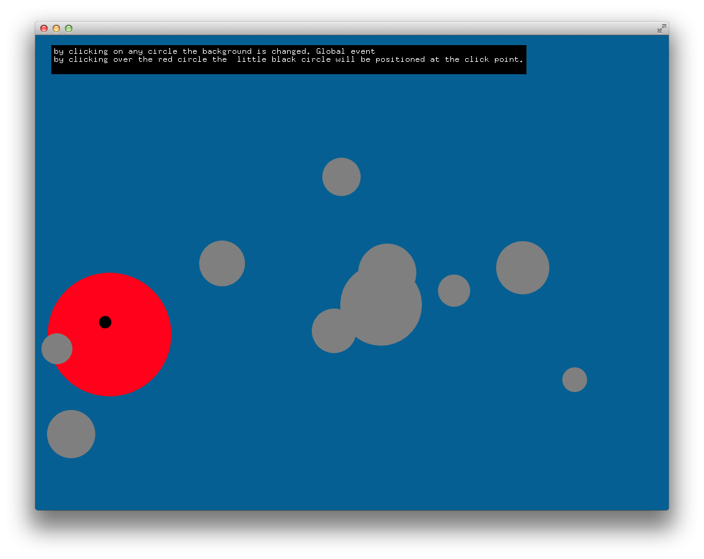
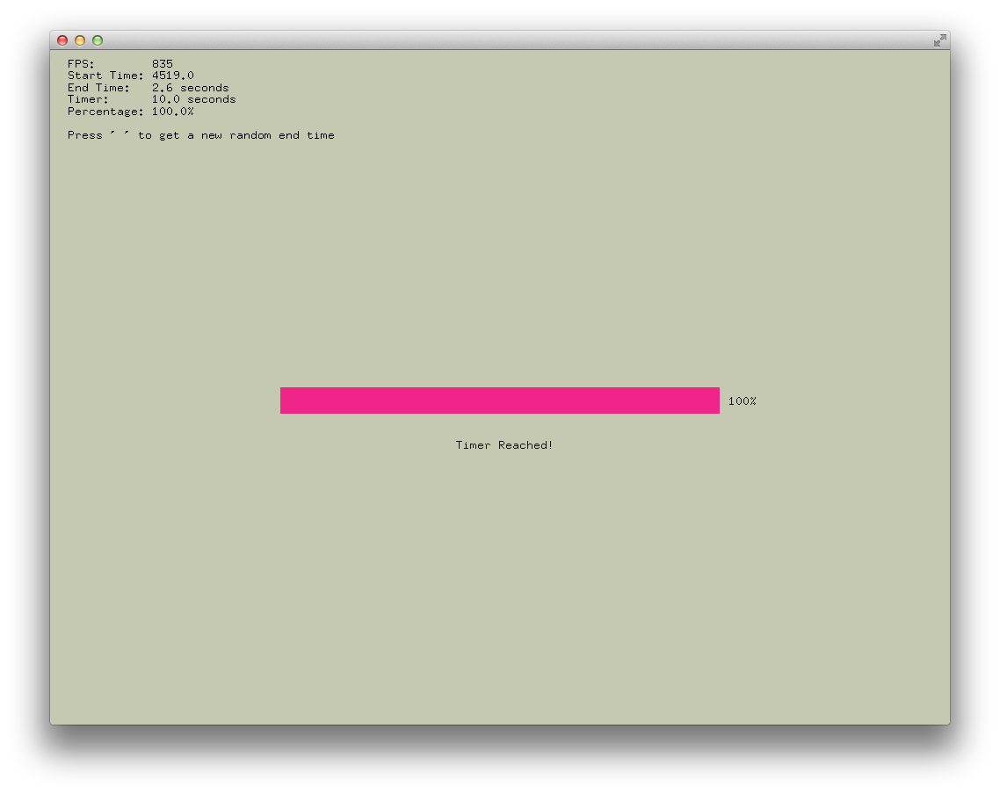

# About events

--

### Learning Objectives

This section of examples aims to provide understanding about the built-in events of OF such as keyboard events and mouse events as well as understanding how to create and use custom events.

### Table of Contents

* [allEventsExample](allEventsExample/) - Built-in OF events

### At a Glance

([allEventsExample](allEventsExample/))

([advancedEventsExample](advancedEventsExample/))

([customEventExample](customEventExample/))

([multiWindowExample](multiWindowExample/))

([multiWindowOneAppExample](multiWindowOneAppExample/))

([simpleEventsExample](simpleEventsExample/))

([simpleTimer](simpleTimer/))
