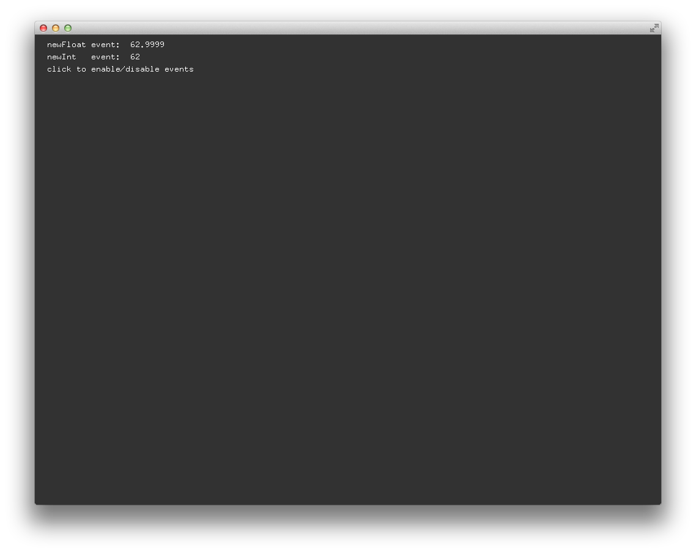

# About advancedEventsExample




### Learning Objectives

This Example demonstrates how to create and use custom events.

After studying this example, you'll understand how to create an object to generate custom events.


In the code, pay attention to:

* OF classes and functions to create custom events:
* ```ofAddListener()```
* ```ofRemoveListener()```
* ```ofEvent```
* ```ofEvents()```
* ```ofNotifyEvent()```


### Expected Behavior


When launching this app, you should see a screen with

* a text display "click to enable/disable events".


Instructions for use:

* Click the mouse button to enable / disable the update function of newFloatEvent and newIntEvent, both instances of eventsObject.


### Other classes used in this file

* ```eventsObject```
