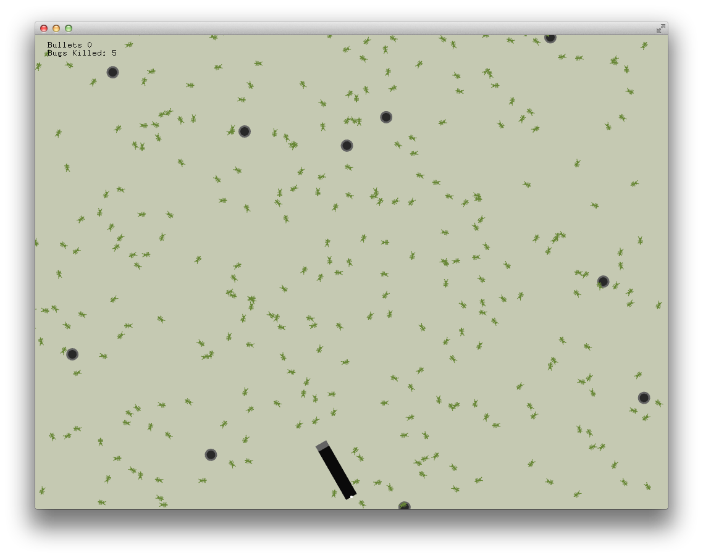

# About customEventExample




### Learning Objectives

 This example demonstrates a simple game. A GameEvent class is
 used to store the bullet and bug that just collided.

After studying this example, you'll understand how to create an object to generate custom events using a class based on ```ofEventArgs```


In the code, pay attention to:

* OF classes and functions to create custom events:
* ```ofEventArgs```, base class for events that don't send any arguments like draw or update
* ```ofAddListener``` to add a listener method to GameEvent
* ```ofNotifyEvent()``` to notify the GameEvent


### Expected Behavior


When launching this app, you should see a screen with

* nine small randomly positioned black circles. Bugs crawl out of the circles and move around the stage.
* a canon pointing upwards at the bottom center of the window rotating on it's bottom vertical axis, its angle mapped to the horizontal mouse position.
* when pressing on the spacebar, the canon shoots a pink bullet. If a bullet hits a bug, the bug disappears.
* a text overlay at the top left corner displays the number of bullets shot and bugs killed.
* A message in the console: "Game Event: BUG HIT" when bullet and bug collide.


Instructions for use:

* Move the mouse on it's horizontal axis to aim canon. Press spacebar to shoot bullets at bugs.


### Other classes used in this file

* ```GameEvent```
* ```Bullet```
* ```Bug```
