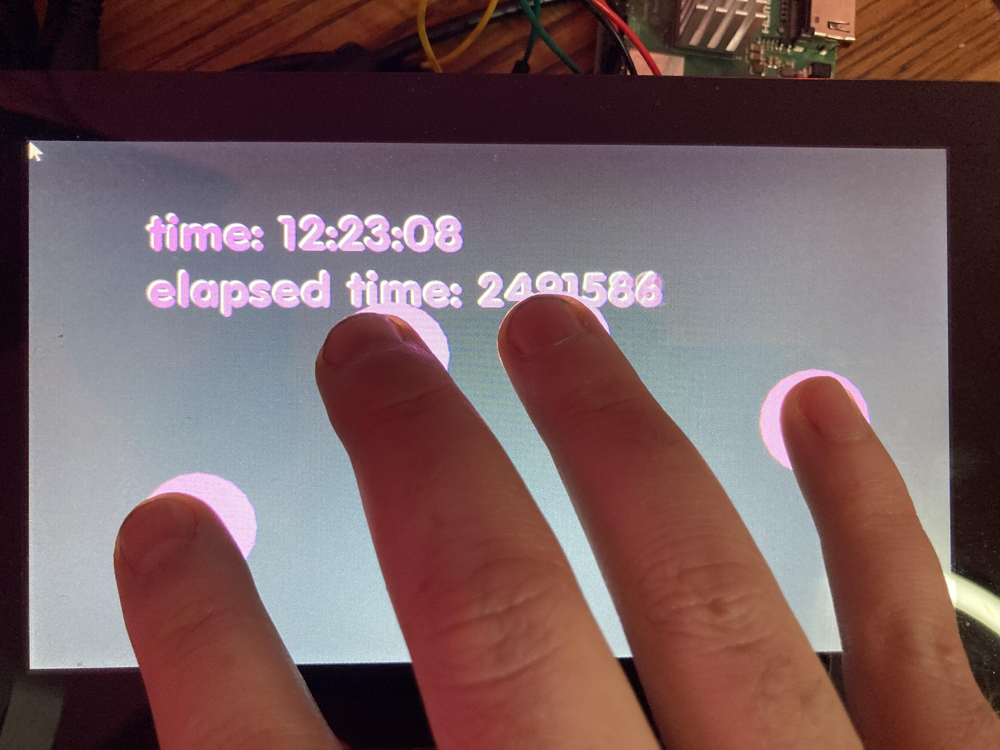

# About rpiTouchExample




### Learning Objectives

This Example demonstrates the touchscreen event of openFrameworks for the [Official Raspberry Pi Touch Display](https://www.raspberrypi.org/documentation/hardware/display/) and the ofAppEGLWindow.

After studying this example, you'll understand how to trigger events and retrieve information from events such as touch down, touch position, and which fingers are touching the screen.

In the code, pay attention to:

* Different commands to access the current time information: ```ofGetTimestampString()``` and ```ofGetElapsedTimeMillis()```
* Access individual key information: 
    * ```void touchDown(int x, int y, int id)```
    *	```void touchMoved(int x, int y, int id)```
    *	```void touchUp(int x, int y, int id)```

### Expected Behavior


When launching this app, you should see a screen with

* a text display of the current time, the elapsed time in milliseconds, the current event being triggered


Instructions for use:

* Touch the screen and you should see pink circle track your touch positions.  


### Other classes used in this file

This Example uses no other classes.
