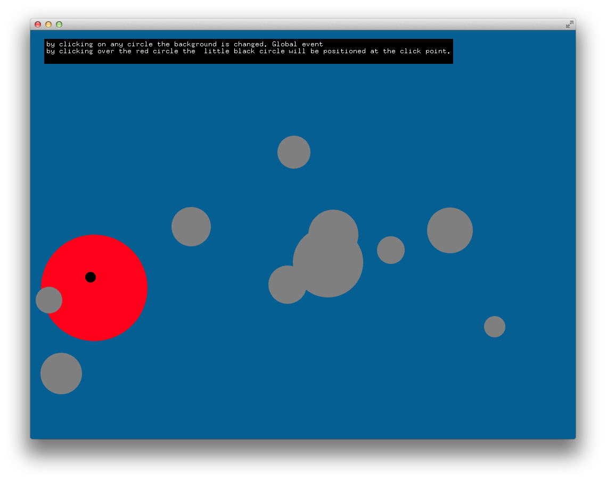

# About simpleEventsExample




### Learning Objectives

This example demonstrates how to listen to events registered as either local or global using a custom class.


In the code, pay attention to:

* ```ofRegisterMouseEvents``` this will enable the circle class to listen to mouse events
* ```ofUnregisterMouseEvents``` disable listening to mouse events


### Expected Behavior

* In the main window, ten grey circles and one red circle displayed at random positions.
* At the top, a text overlay with instructions.


Instructions for use:

* by clicking on any circle the background is changed. Global event
* by clicking over the red circle the  little black circle will be positioned at the click point. Local event


### Other classes used in this file

* ```Circle```
