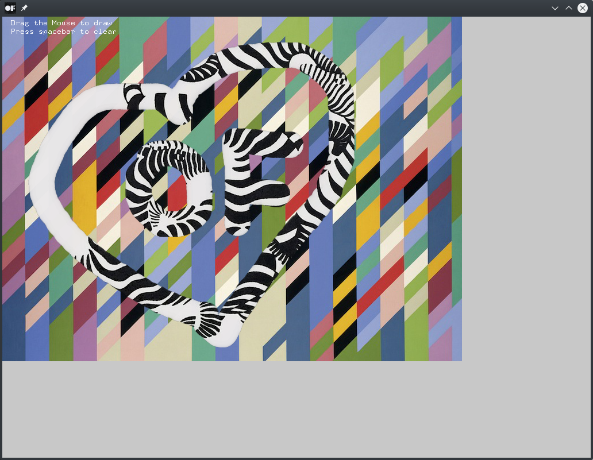

# alphaMaskingShaderExample

### Learning Objectives

This example demonstrates how to create alpha masks using a GL shader to blend two images into each other. It contains a simple GL shader that alters the opacity of image pixels by the color values of another image. It is used to blend two images into each other.

You will learn how to..
* use a GL fragment shader
* build image overlays using frame buffer objects (`ofFbo`)
* create a brush from an `ofImage`

### Expected Behavior

When launching this app, you should see a window containing an image with colorful tiles.

Instructions for use:

* Drag the mouse to draw, a second image with black and white stripes should be visible through the stroke
* press any key to clear the alpha mask / the strokes

### Other classes used in this file

This Example uses the following classes:

* http://openframeworks.cc/documentation/gl/ofFbo/
* http://openframeworks.cc/documentation/gl/ofShader/
* http://openframeworks.cc/documentation/graphics/ofImage/
