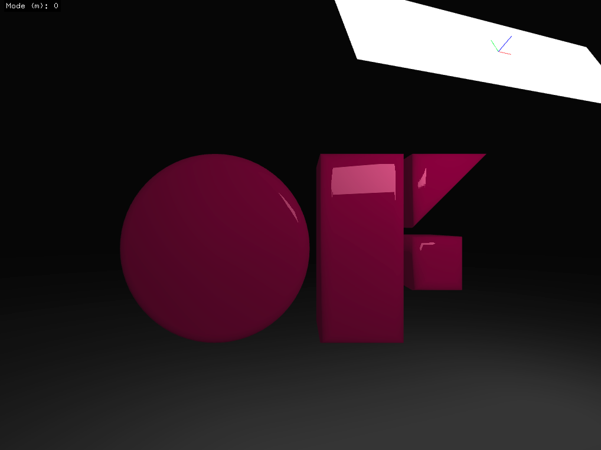

# areaLightExample

### Learning Objectives

This example demonstrates how to create an area light source that is reflected from a plane surface.

You will learn how to..
* easily create an interactive 3D scene with `ofEasyCam`
* create, place and angle a light source
* create an reflecting plane by setting its ambient, diffuse and specular color

### Expected Behavior

When launching this app, you should see a screen showing a white glowing rectangle. The reflection on an otherwise dark surface should react to changes in the camera and light placement.

Instructions for use:

* Use the mouse to adjust the interactive camera
    * Left click drag = orbit the target
    * Right click drag = dolly in and out
	* Double click = reset camera position
* Press the arrow keys `up` or `down` to change the distance between the light source and the reflecting surface
* Press the arrow keys `left` or `right` to change the angle of the light source

### Other classes used in this file

This Example uses the following classes:

* [ofLight](http://openframeworks.cc/documentation/gl/ofLight/)
* [ofPlanePrimitive](http://openframeworks.cc/documentation/3d/ofPlanePrimitive/)
* [ofEasyCam](http://openframeworks.cc/documentation/3d/ofEasyCam/)
* [ofMaterial](http://openframeworks.cc/documentation/gl/ofMaterial/)
