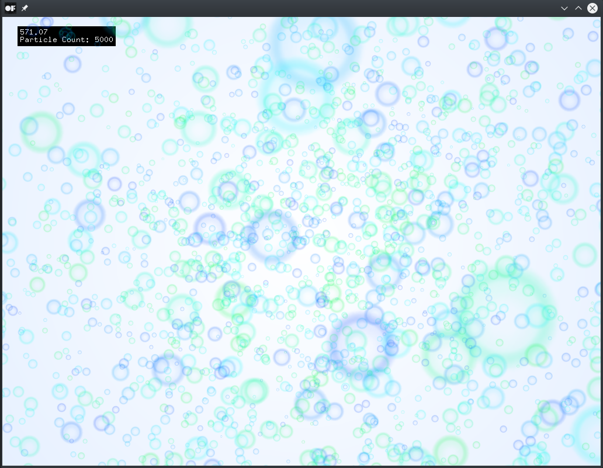

# billboardExample

### Learning Objectives

This example demonstrates the usage of a billboard GL shader to display a large number of moving particles in different sizes. Billboards in 3D computer graphics are sprites that always face the viewer. All particles are displayed using the same image texture.

You will learn how to..
* use a billboard shader
* create particles with random sizes and colors
* apply a texture to all particles at once using `ofVboMesh`
* rotate and zoom the camera view

### Expected Behavior

When launching this app, you should see numerous green and blue bubbles floating across the screen.

Instructions for use:

* Move the cursor to rotate the camera
* Use the `up` and `down` keys to zoom in and out

### Other classes used in this file

This Example uses the following classes:

* [ofImage](http://openframeworks.cc/documentation/graphics/ofImage/)
* [ofShader](http://openframeworks.cc/documentation/gl/ofShader/)
* [ofVboMesh](http://openframeworks.cc/documentation/gl/ofVboMesh/)
