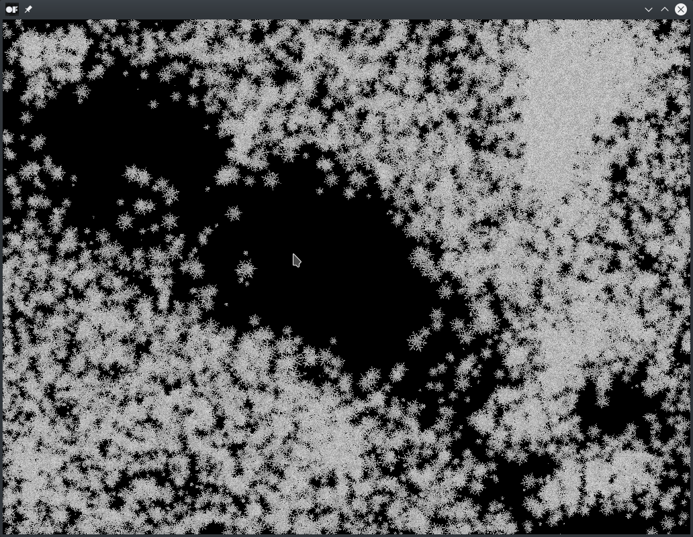

# billboardRotationExample

*Once there was a little cursor. The cursor loved the winter. It would move around catching the snow with its tip virtually the whole day. But the snowflakes adapted and learned to avoid the little cursor. Their play forced the GPU to overheat until nothing of the snowflakes remained than a tepid breath from the fan.*

### Learning Objectives

This example uses the same vertex shader as the billboardExample to display particles moving in 3D that always face the viewer. Here the fragment shader is used additionally to apply a rotation to the texture of the snowflakes. Also the particles move with varying velocities depending on the cursor position.

You will learn how to..
* use a billboard shader that is able to rotate the applied texture in 2D
* use a Vertex Buffer Object (VBO) to create particles
* pass a dynamic attribute of the VBO to the shader
* use a texture to draw the VBO sprites
* create an animation of repelling particles

### Expected Behavior

When launching this app, you should see a window full of snowflakes. Every time a snowflake particle is pushed over a window border, it moves back to its original position from the opposite border. Moving particles should also rotate.

Instructions for use:

* Move the cursor to shovel the snow.

### Other classes used in this file

This Example uses the following classes:

* [ofImage](http://openframeworks.cc/documentation/graphics/ofImage/)
* [ofShader](http://openframeworks.cc/documentation/gl/ofShader/)
* [ofVbo](http://openframeworks.cc/documentation/gl/ofVbo/)
