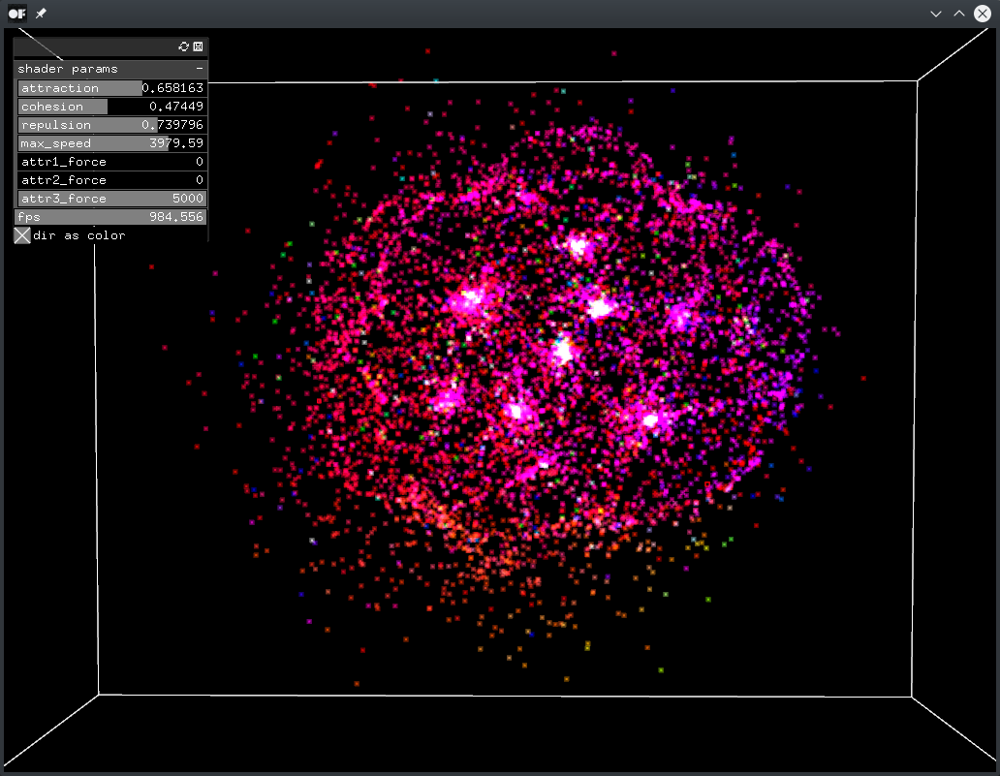

# computeShaderParticlesExample

### Learning Objectives

This example demonstrates how to use a compute shader to set up an animated point cloud with editable parameters. Compute shaders are rather used to do generic computation in contrast to graphics-oriented shaders. In this case the shader computes the movement of particles using a [flocking algorithm](https://en.wikipedia.org/wiki/Flocking%20%28behavior%29#Flocking_rules) based on three parameters: attraction, cohesion and repulsion. It additionally includes different forces in order to separate the particles into groups.

You will learn how to..
* write a shader that animates particles according to their attraction, cohesion or repulsion
* create lively animations using [`ofNoise()`](http://openframeworks.cc/documentation/math/ofMath/#show_ofNoise)
* use `ofParameter` objects and `ofxGui` to create editable variables
* connect parameters to a shader
* set a blend mode
* easily navigate in 3D with `ofEasyCam`

In the code, pay attention to:
* the separation of two particle groups by their `gl_GlobalInvocationID`
* the double buffer (`ofBufferObject`) for faster computation that allows to draw from one buffer while the other one is being updated
* the definition of working groups by setting `dispatchCompute()` from the C++ shader object and `layout()` from within the shader

### Expected Behavior

When launching this app, you should see a cloud of particles floating in the center of a white cube. In the top left corner there is a panel to manipulate the particle cloud. The panel also includes a display of the current framerate.

Instructions for use:

* Use the mouse to adjust the interactive camera
    * Left click drag = orbit the target
    * Right click drag = dolly in and out
	* Double click = reset camera position
* Change the parameters in the panel to manipulate the particle cloud, for example..
	* check "dir as color" to show each particle in a color according to the direction it is heading
	* change `attr1_force` to adjust the force applied to all particles with an odd index
	* change `attr2_force` to adjust the force applied to all particles with an even index

### Other classes used in this file

This Example uses the following classes:

* [ofShader](http://openframeworks.cc/documentation/gl/ofShader/)
* [ofVbo](http://openframeworks.cc/documentation/gl/ofVbo/)
* [ofBufferObject](http://openframeworks.cc/documentation/gl/ofBufferObject/)
* [ofEasyCam](http://openframeworks.cc/documentation/3d/ofEasyCam/)
* [ofParameter](http://openframeworks.cc/documentation/types/ofParameter/)
* [ofParameterGroup](http://openframeworks.cc/documentation/types/ofParameterGroup/)
* [ofxPanel](http://openframeworks.cc/documentation/ofxGui/ofxPanel/)
