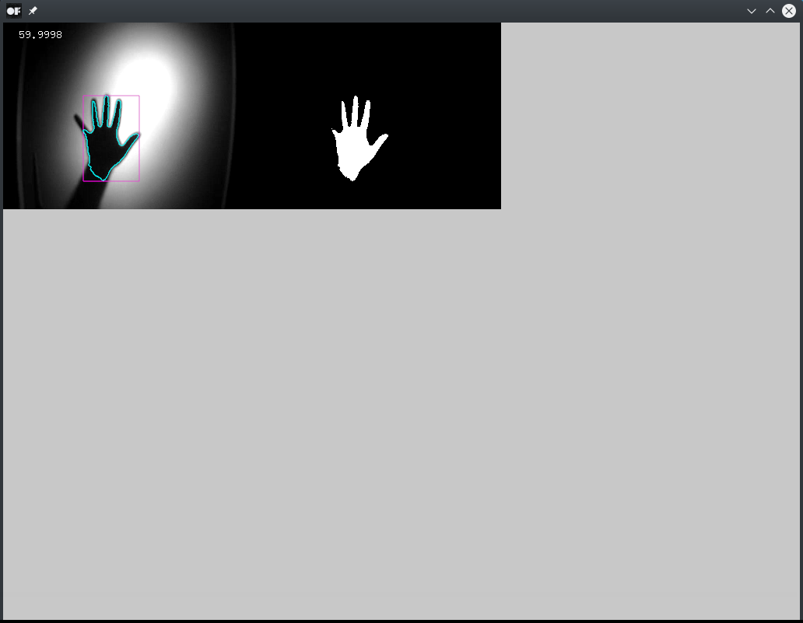

# computeShaderTextureExample

### Learning Objectives

This example demonstrates how to find contours in a video using background subtraction. The compute shader is used to convert a video frame into black and white (binary) pixels by the difference between the frame and a given background image. Afterwards the openCV addon for openFrameworks is used to retrieve a contour as a vector of points.

You will learn how to..
* store the pixels of a video frame into a texture using `ofTexture::loadData()`
* store texture data in an `ofBufferObject` using `ofTexture::copyTo()`
* load data from an `ofBufferObject` to `ofxCvGrayscaleImage`
* compute the difference between two textures
* use the openCV contour finder in openFrameworks

In the code, pay attention to:
* the handling of `GL_READ_ONLY` and `GL_WRITE_ONLY` textures in the C++ code as well as in the shader
* the definition of working groups for parallel computation by setting `dispatchCompute()` from the C++ shader object and `layout()` from within the shader
* the functions a compute shader uses to read and write pixels in comparison to a pixel shader

### Expected Behavior

When launching this app, you should see a window with two image frames. In the top right corner the framerate is displayed. The left frame shows a video of a while light with a hand that appears in front of it as a black contour. On the right side the difference between the current video frame and the defined background image is shown. It is displayed as a black and white (binary) image. Each contour computed from that image appears as a cyan line on top of the left image, framed by a purple bounding rectangle.

Instructions for use:

* Press the space key to use the current video frame as the background image that will be subtracted from all other frames in order to find contours

### Other classes used in this file

This Example uses the following classes:

* [ofShader](http://openframeworks.cc/documentation/gl/ofShader/)
* [ofTexture](http://openframeworks.cc/documentation/gl/ofTexture/)
* [ofVideoPlayer](http://openframeworks.cc/documentation/video/ofVideoPlayer/)
* [ofBufferObject](http://openframeworks.cc/documentation/gl/ofBufferObject/)
* [ofxCvGrayscaleImage](http://openframeworks.cc/documentation/ofxOpenCv/ofxCvGrayscaleImage/)
* [ofxCvContourFinder](http://openframeworks.cc/documentation/ofxOpenCv/ofxCvContourFinder/)
