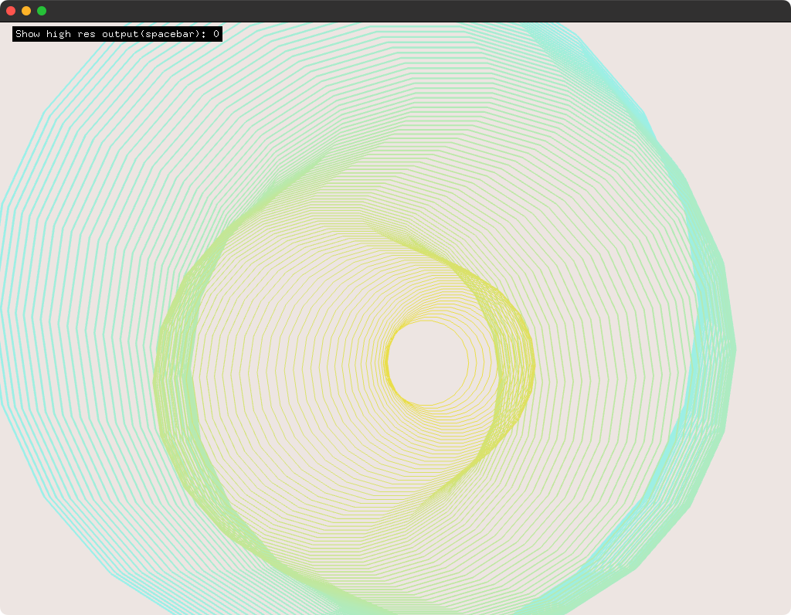

# fboHighResOutputExample

### Learning Objectives

This example is all about Frame Buffer Objects. An `ofFbo` is a container for textures. The example demonstrates how to draw into a higher resolution fbo and save to disk.

You will learn how to..
* use a high resolution fbo
* clear an FBO completely or only partially to slowly fade the content
* draw concentric circles
* scale and fit ofRectangles
* map the mouse position into scaled rectangles

In the code, pay attention to..
* the correct placement of `ofFbo::begin()` and `ofFbo::end()`
* the comment in the `setup()` function explaining how to define an FBO with `ofFbo::Settings`

### Expected Behavior

When launching this app, you should see concentric circles slowly moving around based on the mouse position. If showing the high resolution output, the circles and mouse are mapped to the fbo.

Instructions for use:

* Press 's' to save the fbo to disk.
* Press 'spacebar' to switch between high res or screen resolution.
* Move the mouse to manipulate the position of the circles. 

### Other classes used in this file

This Example uses the following classes:

* [ofFbo](http://openframeworks.cc/documentation/gl/ofFbo/)
