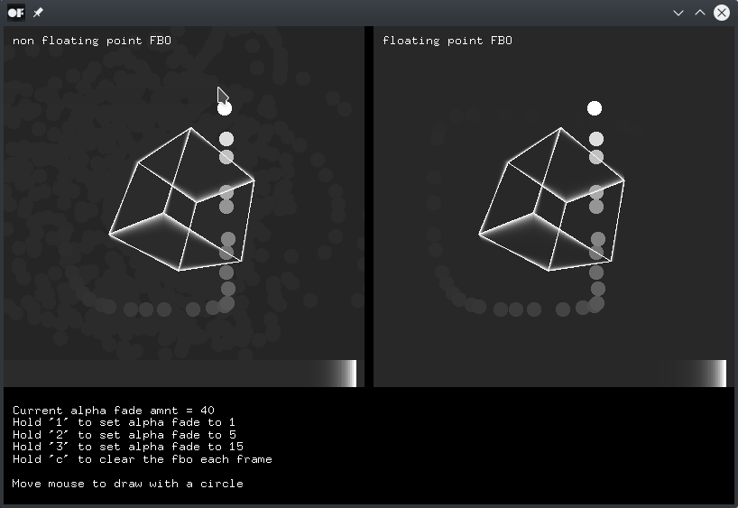

# fboTrailsExample

### Learning Objectives

This example is all about Frame Buffer Objects. An `ofFbo` is a container for textures. The example demonstrates different ways to allocate and clear the container.

You will learn how to..
* use FBOs with alpha channels
* distinguish FBOs allocated with 8 or 32 bits
* save multiple visual objects on the same texture
* clear an FBO completely or only partially to slowly fade the content
* draw a rotating cube
* draw a progress bar

In the code, pay attention to..
* the correct placement of `ofFbo::begin()` and `ofFbo::end()`
* the comment in the `setup()` function explaining how to define an FBO with `ofFbo::Settings`

### Expected Behavior

When launching this app, you should see two frames next to each other. The left one is the 8 bit FBO, the right one was allocated with 32 bit per pixel. The left one can thereby store integer values from 0 to 255 whereas the right one is able to store floating color values. The FBO is cleared partially in every frame with an editable alpha fade amount. The current value is displayed in the first row below the frames.

Instructions for use:

* Hold '1' to set alpha fade to 1.
* Hold '2' to set alpha fade to 5.
* Hold '3' to set alpha fade to 15.
* Hold 'c' to clear the FBO each frame.
* Move the mouse to draw with a circle. You should see that the circles in the right frame fade out smoothly. In the left frame the contrast between the two darkest color values remains visible.

### Other classes used in this file

This Example uses the following classes:

* [ofFbo](http://openframeworks.cc/documentation/gl/ofFbo/)
