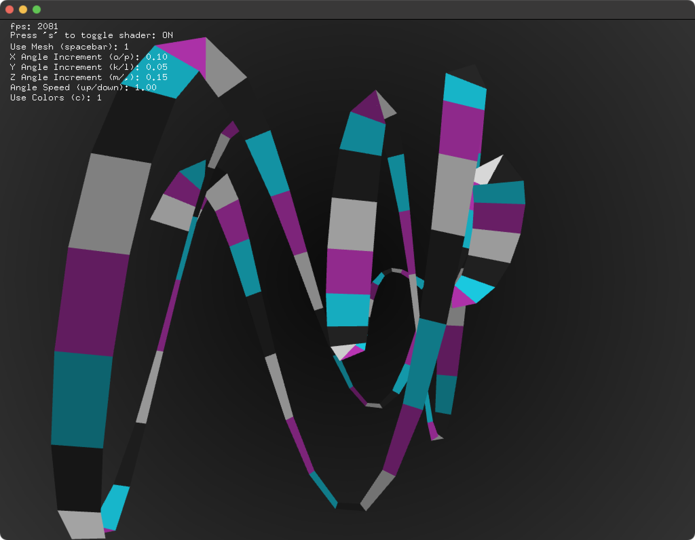

# geometryShaderExample

### Learning Objectives

This example demonstrates how to use [geometry shaders](https://open.gl/geometry). A geometry shader can create new geometries using a small amount of input data. It handles the vertex shader output. In this case it converts a random set of lines into triangle strips and illuminates them.

You will learn how to..
* draw a line from a random set of points
* enable or disable a shader
* load a geometry shader additionally to the vertex and fragment shader
* define attributes of a geometry shader like the input type, output type and output count

In the shader code, pay attention to..
* the creation of new vertices using `EmitVertex()`
* the coloring of the triangle strips based on a vector representing the light direction

### Expected Behavior

When launching this app, you should see a window displaying a random set of strips in different shades of grey. By disabling the shader you should be able to see the white lines that are the source of the strips created by the shader.

Instructions for use:

* Press the `s` key to enable or disable the shader
* Click and drag to move the camera
* Press the `up` and `down` keys to increase speed
* Press `spacebar` to enable or disable rendering with a single mesh

### Other classes used in this file

This Example uses the following classes:

* [ofShader](http://openframeworks.cc/documentation/gl/ofShader/)
