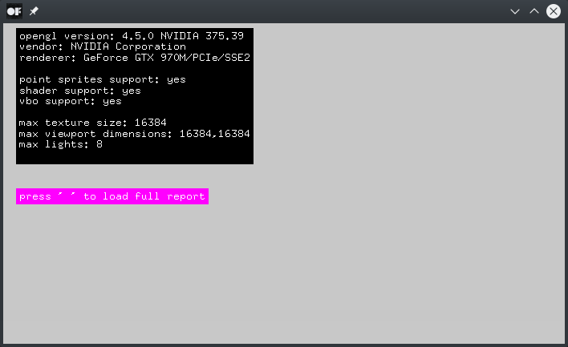

# glInfoExample

### Learning Objectives

This example demonstrates how to display your GL status like the openGL version, details about your graphics card, shader support or available openGL extensions. A full report can be saved to `bin/data/openglReport.txt`. The example also includes a few functions from the OpenGL Extension Wrangler Library (GLEW).

You will learn how to..
* access GL details by using functions like `glGetString()`, `glewIsSupported()` or `glGetIntegerv()`
* retrieve openGL extensions and available calls as a list

### Expected Behavior

When launching this app, you should see a text listing your openGL version, vendor, renderer and other details about your setup.

Instructions for use:

* Press the space key to load the full report. A text editor should open a document containing among other things your openGL extensions and shader limits. It will automatically be saved to `bin/data/openglReport.txt`.

### Other classes used in this file

This Example uses the following classes:

* [glewOutput](src/glewOutput.h)
