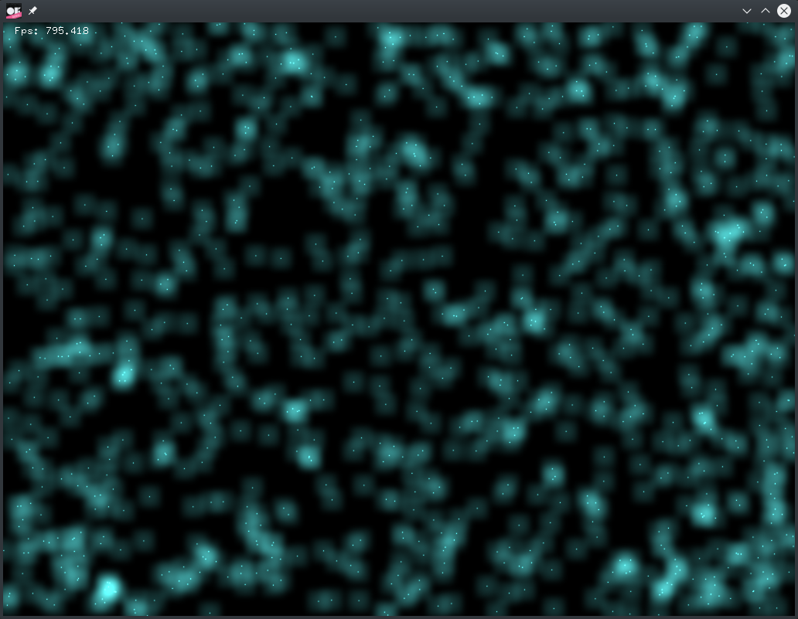

# gpuParticleSystemExample

### Learning Objectives

This example demonstrates how to create a particle system using [Ping Pong](http://www.seas.upenn.edu/~cis565/fbo.htm#feedback) buffers. Because the GPU is not able to rewrite a texture that it is currently reading, we use two Frame Buffer Objects. One can always be calculated while the other one is rendered. This example also demonstrates how to chain up multiple shaders coping with specific particle properties using textures with a pixel for each particle. Finally we line up a billboard shader (this time using a geometry shader) to render the texture of the sparks.

You will learn how to..
* calculate particle systems more efficiently using Ping Pong buffers
* use textures to compute abstract data like the velocity of a particle
* animate particles to bounce between the window borders using one fragment shader for velocity and one for position
* let the geometry shader create a frame of vertices for the particle texture
* create sparks using `OF_BLENDMODE_ADD`
* restrict a blend mode to a specific part of the rendering process using `ofPushStyle()` and `ofPopStyle()`

### Expected Behavior

When launching this app, you should see a window displaying various points rushing over the screen. Each point is visualized by a little dot surrounded by a light turquoise glow. Each one of them moves straight until hitting the window border before bouncing of with half the speed.

Instructions for use:

* Watch and enjoy.

### Other classes used in this file

This Example uses the following classes:

* [ofShader](http://openframeworks.cc/documentation/gl/ofShader/)
* [ofVboMesh](http://openframeworks.cc/documentation/gl/ofVboMesh/)
* [ofFbo](http://openframeworks.cc/documentation/gl/ofFbo/)
* [ofImage](http://openframeworks.cc/documentation/graphics/ofImage/)
