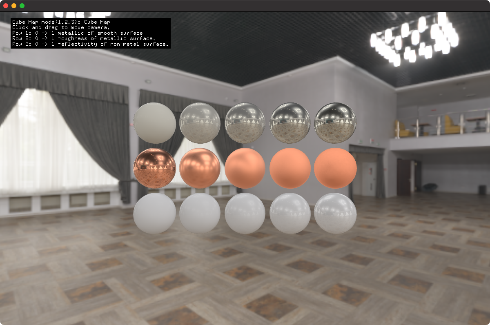

# materialPBRExample

### Learning Objectives

This example demonstrates how to use setup a PBR material and scene with a camera. It demonstrates the use of a cube map with textures. 

You will learn how to..
* setup a cube map and load a HDR image into it.
* configure materials for PBR
* use an ofEasyCam
* use a material and change its properties inside begin()

Pay attention to..
* the define `USE_CUBE_MAP` 
* `material.begin();` and the for loops inside it.
* `material.setRoughness(0.05);`

### Expected Behavior

When launching this app, you should see 3 rows and 5 columns of spheres. The top row changes the metalness. The middle row changes the roughness of metallic spheres. The bottom row changes the reflectance of non-metallic spheres.

Instructions for use:

* Press `1,2,3` to change the rendering of the cube map.
* Click and drag to move camera.
* Try commenting out `//cubeMap.load("dancing_hall_2k.exr", 512, true );` in ofApp.cpp in `setup()`;
* Try commenting out `//#define USE_CUBE_MAP` in ofApp.h

### Other classes used in this file

This Example uses the following classes:

* [ofEasyCam](http://openframeworks.cc/documentation/3d/ofEasyCam/)
* [ofMaterial](http://openframeworks.cc/documentation/gl/ofMaterial/)
* [ofCubeMap](https://openframeworks.cc/documentation/gl/ofCubeMap/)
