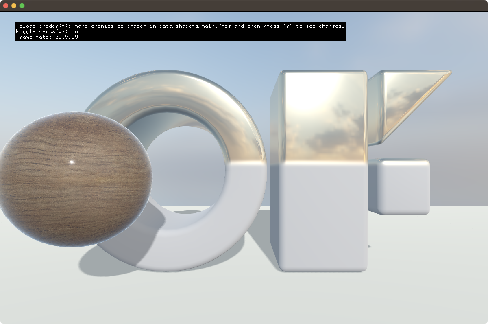

# materialPBRAdvancedExample

### Learning Objectives

This example demonstrates how to use setup a multiple PBR materials and scene with a camera. It demonstrates the use of a cube map with textures and a light with shadows. It also shows dynamic materials via shaders on non-textured meshes. And a material with textures and a clear coat. 

You will learn how to..
* setup a cube map and load a HDR image into it.
* configure materials for PBR
* use an ofEasyCam
* use a material and change its properties inside begin()
* use a material load a shader to replace its main function to change output without recompiling.

Pay attention to..
* the define `light.beginShadowDepthPass(j)` 
* `renderScene()` function and its use with light shadows.
* the `reloadShader();` function and how it updates the shader on the material used to render the logo mesh.

### Expected Behavior

When launching this app, you should see an OF logo and 2 spheres circling it; one looking like plywood with gloss and another a black metal. 

Instructions for use:

* Press `d` to show debug information, ie light frustum.
* Click and drag to move camera.
* Try launching the app and then editing the main.frag shader in `bin/data/shaders/main.frag;` Then select the app window and press `r` to reload the shader and view changes.
* Try commenting out `cubeMap.load( "dancing_hall_2k.exr", 512 );` in ofApp::setup();

### Other classes used in this file

This Example uses the following classes:

* [ofEasyCam](http://openframeworks.cc/documentation/3d/ofEasyCam/)
* [ofMaterial](http://openframeworks.cc/documentation/gl/ofMaterial/)
* [ofCubeMap](https://openframeworks.cc/documentation/gl/ofCubeMap/)
* [ofMesh](https://openframeworks.cc/documentation/3d/ofMesh/)
