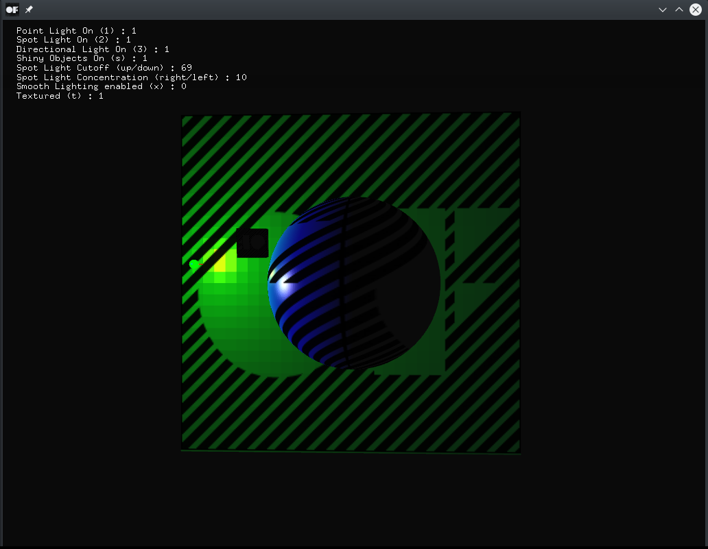

# multiLightExample

### Learning Objectives

This example is the perfect starting point if you want to try out different light sources and their interaction with various objects. The animations and the possibility to alter attributes regarding the graphics library, the lights and the objects gives you the power to compare and understand the settings. There is more information about the different light sources on [the `ofLight` documentation page](http://openframeworks.cc/documentation/gl/ofLight/).

You will learn how to..
* create point lights, spot lights and directional lights
* create 3D objects with different materials and reflection properties
* animate both light sources and objects
* apply a texture to all drawn vertices
* alter the shininess of objects
* set the spotlight cutoff angle

### Expected Behavior

When launching this app, you should see multiple animated objects: a large cube behind a sphere, both rotating around their own axis and a little rotating cube moving towards the camera and back. You should also see a light source represented by a green sphere and a coordinate system rotating around the sphere in the center. That's the point light that spreads outward evenly in all directions. The directional light has no position, it takes care of illuminating all objects from a certain angle based on their orientation.

Instructions for use:

* Move the cursor: You should see a red cone representing the spot light
* Press '1' to enable or disable the point light
* Press '2' to enable or disable the spot light
* Press '3' to enable or disable the directional light
* Press 's' to set or remove the shininess of the objects
* Press the `up` or `down` arrow keys to change the spot light cutoff
* Press the `left` or `right` arrow keys to change the spot light concentration
* Press 'x' to enable or disable smooth lighting
* Press 't' to enable or disable the texture

### Other classes used in this file

This Example uses the following classes:

* [ofLight](http://openframeworks.cc/documentation/gl/ofLight/)
* [ofMaterial](http://openframeworks.cc/documentation/gl/ofMaterial/)
* [ofImage](http://openframeworks.cc/documentation/graphics/ofImage/)
