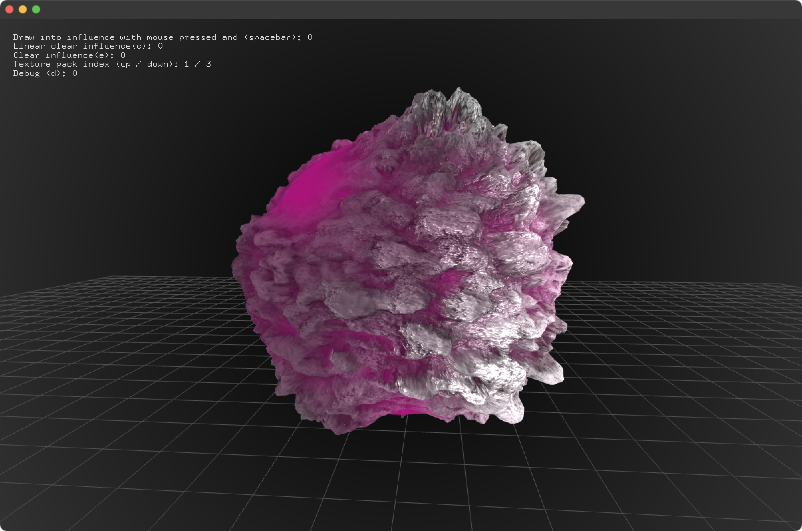

# multiTexture3dExample

### Learning Objectives

This example demonstrates how to use multiple textures in a shader. The vertex shader will use a displacement map texture to determine the amount to 'push out' the vertices of the mesh. The frag shader will apply lighting based on a normal map, diffuse texture and ambient occlusion texture using 2 lights. A fbo will be used to determine how much the textures should influence the sphere. By default the sphere has a slight phong shading with a solid color.

You will learn how to..
* load textures from a directory
* configure textures for mapping to a sphere
* use a vertex shader to displace vertices based on a texture map
* write a single fragment shader that processes all of the textures and applies lighting
* draw into a fbo using the mouse position

Pay attention to..
* the `TexturePack` class in ofApp.h
* the material and textures sent to the shader
* fbo being drawn into using a brush image

### Expected Behavior

When launching this app, you should see a single sphere and a grid plane on a dark background.

Instructions for use:

* Press and hold spacebar to draw into the fbo to increase texture influence.
* Press `d` to toggle debug
* Press `up` and `down` to cycle through the 3 texture packs

### Other classes used in this file

This Example uses the following classes:

* [ofShader](http://openframeworks.cc/documentation/gl/ofShader/)
* [ofFbo](http://openframeworks.cc/documentation/gl/ofFbo/)
* [ofMesh](https://openframeworks.cc/documentation/3d/ofMesh/)
* [ofFbo](https://openframeworks.cc///documentation/gl/ofFbo/)
* [ofLight](https://openframeworks.cc///documentation/gl/ofLight/)
* [ofMaterial](https://openframeworks.cc///documentation/gl/ofMaterial/)
* [ofTexture](https://openframeworks.cc///documentation/gl/ofTexture/)
