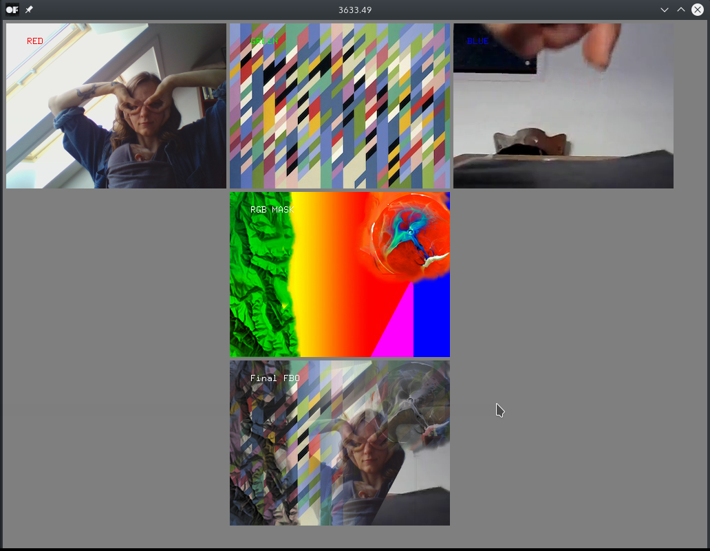

# multiTextureShaderExample

### Learning Objectives

This example demonstrates how to use multiple textures in a shader. To merge the textures the shader calls the openGL function `mix` that linearly interpolates between two values. One texture is thereby used as a color mask, the remaining three textures are shown based on the assigned color channel and the color value of the mask.

You will learn how to..
* load a video
* load an image
* load the webcam stream
* write a single fragment shader that processes all of these textures
* display the framerate in the window title

Pay attention to..
* the different ways of loading a shader (read the comments in the `setup` function)

### Expected Behavior

When launching this app, you should see five textures. In the top row each texture represents a color channel and is labeled accordingly (*RED*, *GREEN* and *BLUE*). The first one is showing the webcam stream, the middle one an abstract still of colorful tiles and the right texture is showing a video of moving fingers. Below you see the image used as an RGB mask that determines how the three top images are mixed together. The result is displayed at the bottom.

Instructions for use:

* Move the cursor left and right to move the color mask horizontally.

### Other classes used in this file

This Example uses the following classes:

* [ofShader](http://openframeworks.cc/documentation/gl/ofShader/)
* [ofFbo](http://openframeworks.cc/documentation/gl/ofFbo/)
* [ofImage](http://openframeworks.cc/documentation/graphics/ofImage/)
* [ofVideoPlayer](http://openframeworks.cc/documentation/video/ofVideoPlayer/)
* [ofVideoGrabber](http://openframeworks.cc/documentation/video/ofVideoGrabber/)
