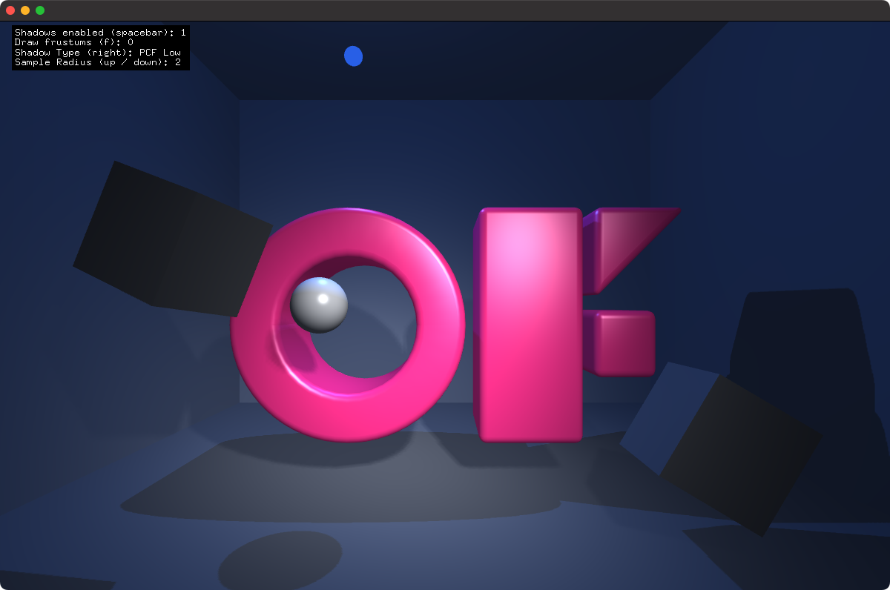

# shadowsExample

### Learning Objectives

This example demonstrates how to use multiple lights, shadows, materials and meshes. The lights move around the scene and slowly change color. 

You will learn how to..
* setup a point and spot light with shadows
* configure materials
* load a mesh from disk
* use a function to render a scene multiple times in one draw call
* draw the light shadow frustums

Pay attention to..
* `ofShadow::enableAllShadows()` 
* `ofShadow::setAllShadowNormalBias(-4.f);`
* `ofShadow::setAllShadowTypes(shadowType);`
* the light for loop in the draw function to render the scene into the shadow depth maps, ie `if( light->shouldRenderShadowDepthPass() ) {`

### Expected Behavior

When launching this app, you should see the OF logo, two cubes, a sphere and a point light going through the `O`.

Instructions for use:

* Press `spacebar` to enable and disable shadows.
* Press `f` to toggle drawing frustums
* Press `right` to change the shadow type between hard and softer shadows
* Press `up` and `down` to increase and decrease the sample radius, the larger the sample, the more blurry ( does not apply to hard shadows ).

### Other classes used in this file

This Example uses the following classes:

* [ofShader](http://openframeworks.cc/documentation/gl/ofShader/)
* [ofFbo](http://openframeworks.cc/documentation/gl/ofFbo/)
* [ofMesh](https://openframeworks.cc/documentation/3d/ofMesh/)
* [ofFbo](https://openframeworks.cc///documentation/gl/ofFbo/)
* [ofLight](https://openframeworks.cc///documentation/gl/ofLight/)
* [ofMaterial](https://openframeworks.cc///documentation/gl/ofMaterial/)
* [ofTexture](https://openframeworks.cc///documentation/gl/ofTexture/)
