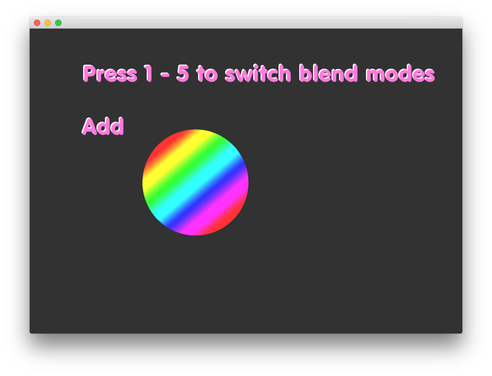

# About blendingExample




### Learning Objectives

This example demonstrates how to set the blend mode and the available blend modes for usage.

In the code, pay attention to:

* Use ```ofEnableBlendMode()``` to set the blend mode.
* The enumerators for the different blend mode types including ```OF_BLENDMODE_ALPHA```, ```OF_BLENDMODE_ADD```, ```OF_BLENDMODE_MULTIPLY```,```OF_BLENDMODE_SUBTRACT``` and ```OF_BLENDMODE_SCREEN```

### Expected Behavior

When launching this application you will see:

* A dark gray background
* Instructional text for how to alter the blend mode based on keyboard input
* Display text to identify which blend mode is in current use
* A circle that is filled with an undeniably awesome rainbow gradient

When keys ```1```, ```2```, ```3```,```4``` or ```5``` are pressed :

* the blend mode associated with that key will be applied
* the display text will identify which blend mode is currently being used.

When the mouse is moved:

* The rainbow gradient circle will follow the position of the mouse

Instructions for use:

* Press ```1``` to switch to a blend mode of Alpha
* Press ```2``` to switch to a blend mode of Additive
* Press ```3``` to switch to a blend mode of Multiply
* Press ```4``` to switch to a blend mode of Subtract
* Press ```5``` to switch to a blend mode of Screen


### Other classes used in this file

This Example uses no other classes.
