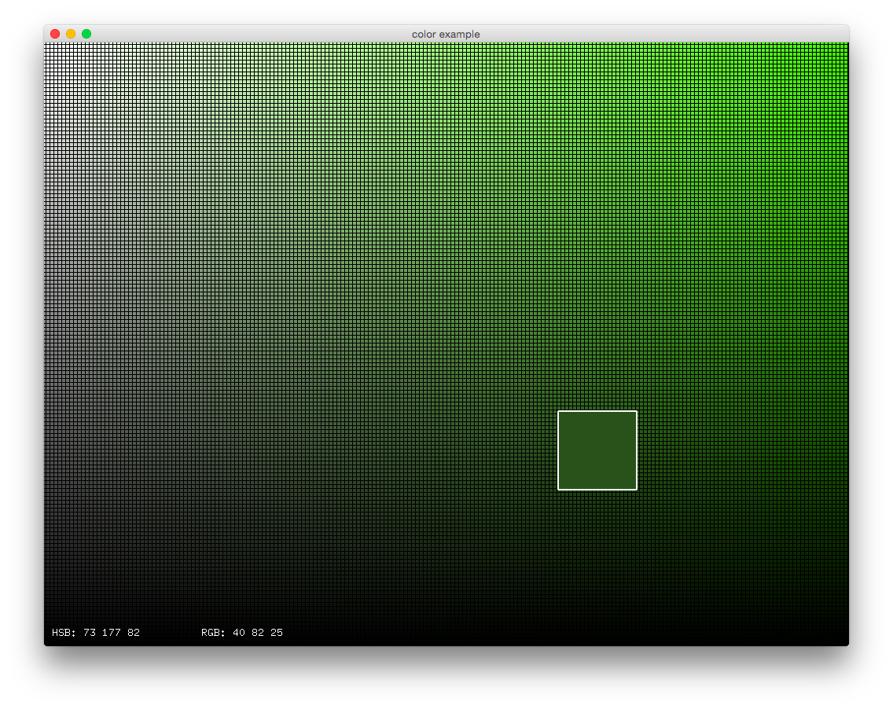

#level1_color
--


### Learning Objectives

This openFrameworks Example is designed to demonstrate setting colors using HSB (Hue/Saturation/Brightness) rather than the more well-known RGB (Read/Green/Blue).

In this example, pay attention to the following code: 

* Creating a variable to store the color ```ofColor colorName```
* Setting the HSB value ```colorName.setHsb(float hue, float saturation, float brightness)```
* Command for setting the active color, such as ```ofSetColor()``` 
* How to map hue values from 0 - 255 and set colors using these values -- command used to map hue from 0 to 255, same concept as % integer modulo (the % operator) for floats ```fmodf(float, float)``` 

####HSB Definition

* **Hue** refers to the 'color' in the rainbow sense, moving from red through yellow through; green through blue through purple through red, looping around again.
* **Saturation** refers to the intensity of the color. high saturation means intense color,low saturation means washed out or black and white.    
* **Brightness** refers to how light or dark the color is. high brightness means a bright color, low brightness is dark. if the brightness is 0 the resulting color will be black, regardless of the values for hue or saturation.


### Expected Behavior

When launching this app, you should see:

* a screen with with a grid of 5 pixel x 5 pixel rectangles with a fixed hue, varying in saturation and brightness over x and y
* you will also see a larger rectangle that takes the color under the mouse. 

Instructions for use:

* Move your mouse to see the different colors across the grid. 


### Other classes used in this file

This Example uses no additional classes.


