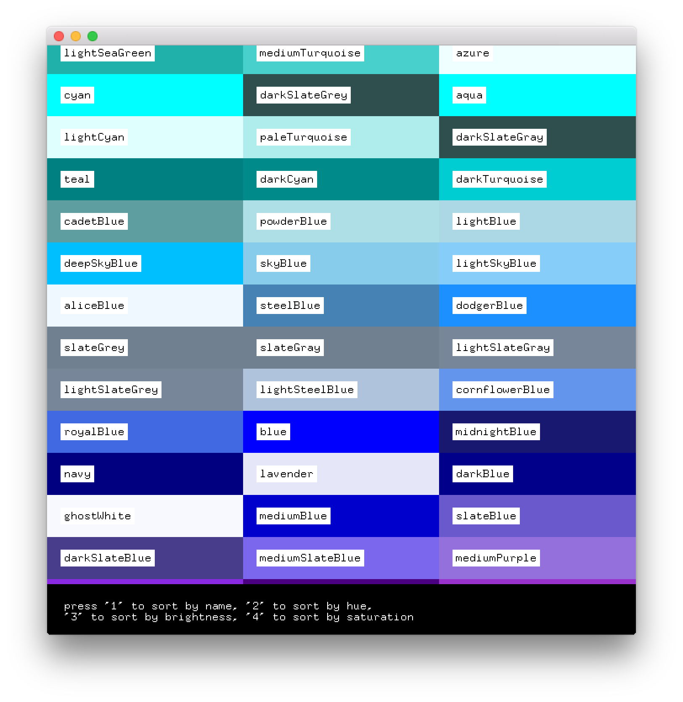

# About colorsExtended




### Learning Objectives

This example demonstrates advanced usage of working with colors including brightness, hue and saturation. 

In the code, pay attention to: 

* The map created to refer to the list of```ofColor``` in a friendly name format
* Using ```color.getBrightness()``` to return the brightness of the color
* Using ```color.getHue()``` to return the hue of the color
* Using ```color.getSaturation()``` to return the saturation of the color
* Comparision functions that sort the colors based on name, brightness, hue or saturation
 
### Expected Behavior

When launching this application you will see: 

* A grid of colors with their name listed
* Instructional text at the bottom for sorting the color grid

When the mouse is moved:

* The color grid will scroll to reveal the full grid as it is too large for the application area

Instructions for use:

* Move the mouse to "scroll" the grid of colors
* Press ```1``` to sort the color grid by name
* Press ```2``` to sort the color grid by hue
* Press ```3``` to sort the color grid by brightness
* Press ```4``` to sort the color grid by saturation

### Other classes used in this file

This Example uses no other classes.