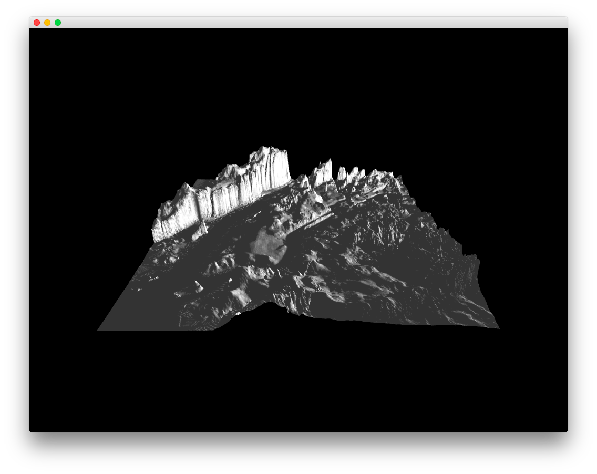

#Level2_floatingPointImageExample
--


### Learning Objectives

This openFrameworks Example is designed to demonstrate how to draw a mesh using floating points.

In this example, pay attention to the following code:

* ```ofEasyCam``` a simple camera for interacting with objects in 3D space
* ```mesh.addNormal(normal)``` adds a normal to the mesh as a 3D vector, typically perpendicular to the plane of the face. 
* ```mesh.advertex(a)``` adding vertices to mesh 
* ```mesh.setmode()``` specifies what primitive mode the mesh should be set to 
* ```mesh.draw()``` draws the mesh
* ```getVertexFromImg```gets the vertex from the image using ```glm::vec3```


### Expected Behavior

When launching this app, you should see:

* a 3D mesh drawn from the image


### Other classes used in this file

This Example does not use any other classes. 
